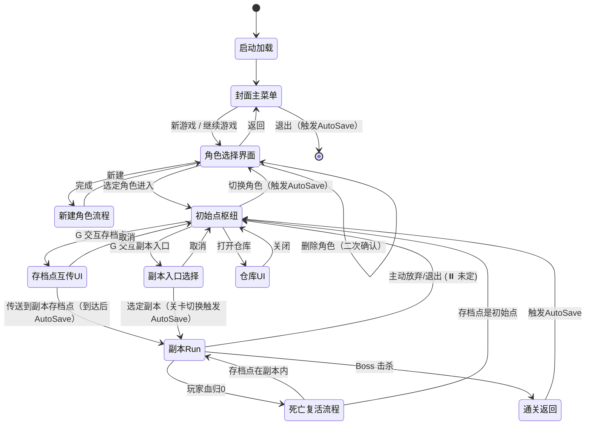
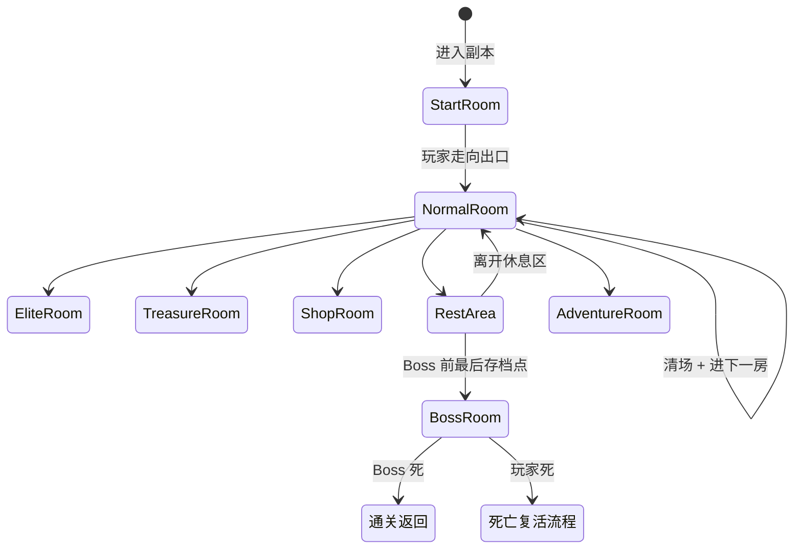
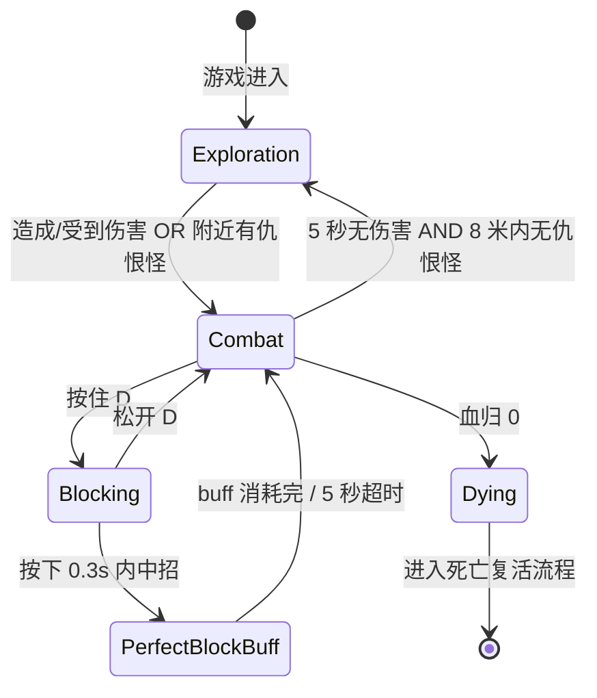
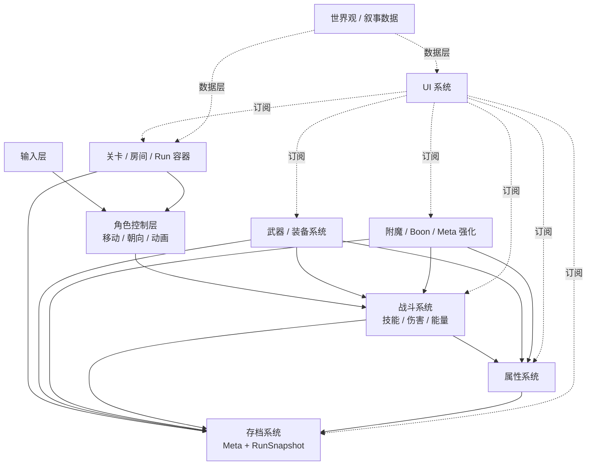

# 架构骨架梳理（v1.1 架构骨架版）

> **文档定位**：从**策划**到**工程**的桥梁文档。把 01~04 的设计决策抽出"**只影响代码架构的骨架**"，交给主架构师（RPG Architect）和各领域子 Agent 做技术设计。
> **读者**：
> - 主架构师（ue-rpg-architect-57）——基于本文档做技术架构设计
> - 战斗 / 装备 / 存档 / UI / 世界内容 各领域子 Agent ——基于本文档对接工程
> - 主理人——验证"骨架是否完整覆盖你需要的玩法"
> **不包含**：具体数值、具体内容（武器叫什么、Boon 叫什么、副本什么主题）、具体 UE/Lyra 技术词（GAS/ASC/GE/UMG）、具体 C++ 类名
> **版本**：v1.1（主理人第六轮 3 项架构级决策锁定：武器仓库 + 多角色多存档槽 + 自动存档）/ v1
> **日期**：2026-01
> **依赖文档**：`01_需求评估与空缺分析.md`、`02_战斗操作与能量决策.md`（v3.1）、`03_死亡惩罚与存档点设计.md`（v1.2）、`04_世界观与叙事骨架.md`、`需求草稿.txt`
>
> **⏸️ 本文档严格遵循"代码骨架优先"原则**：
> - ✅ 谈：结构、类型、层级、状态机、字段、接口、流程、数据持久化边界
> - ❌ 不谈：具体数值、具体内容、具体技能表现、具体敌人行为、UI 美术、文案
> - ❌ 不谈：C++ 技术细节、UE/Lyra 特定 API 名称（让主架构师决定怎么落到引擎层）
>
> **v1.1 本轮变更速览**（主理人第六轮 3 项架构级决策）：
> - **① §3 武器系统骨架扩展**：§3.1 新增"仓库槽"；§3.4 卸下终点改为"仓库"；新增 **§3.7 武器仓库操作管线**。
> - **② §6 存档与持久化骨架重写**：Meta 档顶层改为 `Map<CharacterID, MetaSaveData> + GlobalSettings`；§6.2 加 WeaponStorage；新增 **§6.9 自动存档架构** + **§6.10 角色管理**。
> - **③ §2 Core Loop 主状态机更新**：插入"角色选择界面"节点；新增新建角色流程；更新退出游戏触发自动存档。
> - **④ §10 交付清单新增 3 模块**：模块 12（角色管理）、模块 13（武器仓库）、模块 14（自动存档触发器）。
> - **⑤ §10.X 新增"给主架构师的数据模型接力清单"**：列出所有需要 C++ 层面设计的数据结构。
> - **⑥ §12.1 Top 3 标记为 ✅ 已锁定**（做）；保留剩余 7 个开放问题。

---

## 目录

- [§1 架构原则与本阶段目标](#1-架构原则与本阶段目标)
- [§2 Core Loop 主状态机](#2-core-loop-主状态机)
- [§3 武器系统骨架](#3-武器系统骨架)
  - [§3.7 武器仓库操作管线（v1.1 新增）](#37-武器仓库操作管线v11-新增)
- [§4 肉鸽强化三层体系骨架](#4-肉鸽强化三层体系骨架)
- [§5 关卡与房间骨架](#5-关卡与房间骨架)
- [§6 存档与数据持久化骨架](#6-存档与数据持久化骨架)
  - [§6.9 自动存档架构（v1.1 新增）](#69-自动存档架构v11-新增)
  - [§6.10 角色管理（v1.1 新增）](#610-角色管理v11-新增)
- [§7 战斗系统骨架](#7-战斗系统骨架)
- [§8 UI 骨架](#8-ui-骨架)
- [§9 各模块依赖图](#9-各模块依赖图)
- [§10 本阶段代码框架交付清单](#10-本阶段代码框架交付清单)
  - [§10.3 给主架构师的数据模型接力清单（v1.1 新增）](#103-给主架构师的数据模型接力清单v11-新增)
- [§11 挂起清单（⏸️）](#11-挂起清单)
- [§12 开放问题清单（影响代码架构的）](#12-开放问题清单)
- [§13 变更日志](#13-变更日志)

---

## §1 架构原则与本阶段目标

### 1.1 本阶段核心目标（必达）

> **让游戏整体跑起来**。主理人定调：**主菜单 → 初始点 → 进副本 → 打怪 → 死亡 → 存档点复活 → 回初始点 → 再次进副本**，全流程跑通，内容可以是占位。

具体"能跑起来"定义：

| 环节 | 能跑起来的判定 |
|---|---|
| 主菜单 | 能点击"新游戏 / 继续游戏"，进入游戏 |
| 初始点 | 玩家在枢纽地图出生，能走动，能看到"副本入口"交互点 |
| 进副本 | 从初始点走向副本入口按 G，能切换到副本场景 |
| 打怪 | 占位怪能被攻击、能掉血、能死亡，玩家也能掉血 |
| 死亡 | 玩家血归 0 触发死亡流程，进入复活管线 |
| 存档点复活 | 从最近存档点的快照数据恢复，玩家出现在该存档点 |
| 回初始点 | 通过"存档点互传"或"通关"回到枢纽 |
| 再次进副本 | 循环验证——整条链路可反复触发 |

### 1.2 本阶段不在范围内（⏸️）

以下内容**不需要**在本阶段实现：

- 具体数值（伤害公式系数、能量获取具体值、Boon 加成）
- 具体内容（有哪 4 把武器、副本叫什么、怪物长什么样）
- 具体技能表现（动画、特效、Hit Stop、镜头抖动）
- 具体敌人行为（AI 行为树配置）
- UI 美术（按钮样式、字体、配色）
- 新手引导（教学弹窗、引导箭头）
- 平衡性调优
- 具体剧情 / 文案 / 对话

### 1.3 架构三原则

| 原则 | 说明 |
|---|---|
| **1. 空跑闭环优先** | 先搭通"从主菜单到死亡复活"的完整循环，再填内容 |
| **2. 数据驱动** | 武器、Boon、副本、房间、附魔、敌人等全部**数据资产驱动**，代码只处理"如何读这些资产"，不硬编码"到底是什么" |
| **3. 挂起字段预留** | 将来需要但本阶段不填的字段（如"具体副本主题"），schema 层面预留，代码层面跑空流程 |

---

## §2 Core Loop 主状态机

### 2.1 主状态机（文字版）

```
[启动加载]
    ↓
[封面主菜单]
    ├── 新游戏 / 继续游戏 → [角色选择界面]（v1.1 新增）
    └── 设置 / 退出 → 外部流程（退出时触发 AutoSave）
        ↓
[角色选择界面]（v1.1 新增）
    ├── 选择现有角色 → 读取该角色 Meta + RunState → 下一步
    ├── 新建角色 → [新建角色流程] → 回到角色选择
    ├── 删除角色（二次确认）→ 整档销毁 → 回到角色选择
    └── 返回主菜单
        ↓
[新建角色流程]（v1.1 新增）
    ├── 输入角色名
    ├── 选择默认外观（⏸️ Demo 可占位）
    ├── 生成新 CharacterID (UUID)
    ├── 写入初始 MetaSaveData（仓库空 / 资源初始值 / 属性默认）
    └── 回到角色选择界面
        ↓
[初始点枢纽]（此时已锁定当前 CharacterID + 读取其 MetaSaveData）
    ├── 与 NPC 交互 / 管理 Meta 升级 / 整理装备
    ├── 打开仓库 UI（v1.1 新增）→ 装备/卸下武器
    ├── 切换角色（菜单子项，触发 AutoSave 后回角色选择界面）（v1.1 新增）
    └── 走向副本入口按 G → [副本入口选择]
        ↓
[副本入口选择]（枢纽内的场景切换触发点）
    └── 选择已解锁的副本 → [副本 Run 开始]（关卡切换 → 触发 AutoSave，v1.1）
        ↓
[副本 Run]
    └── 子状态机：房间序列（见 §5）
        ├── 中途可进入：休息区 / 存档点 / 商店 / 宝物房 / 奇遇房
        ├── 进入 Boss 房前瞬间 → 触发 AutoSave（v1.1）
        ├── 死亡 → [死亡复活流程]
        └── Boss 通关 → [通关返回]（→ 触发 AutoSave）
            ↓
[死亡复活流程]
    ├── 死亡动画 → 黑屏 → 加载最近存档点 RunSnapshot → 存档点复活
    └── 回到：最近存档点所在状态（可能在初始点、也可能在副本内存档点）
        ↓
[通关返回]
    ├── 写 Meta（解锁进度、奖励入 Meta 货币）
    ├── 触发 AutoSave（关卡切换点）
    └── 回到 [初始点枢纽]
        ↓
[循环继续]
```

### 2.2 主状态机（Mermaid）



### 2.3 状态边界表

| 状态 | 进入条件 | 退出条件 | 可触发事件 | 关卡数据化边界 |
|---|---|---|---|---|
| 启动加载 | 程序启动 | 加载完毕 | — | — |
| 封面主菜单 | 启动加载结束 | 玩家选择菜单项 | 读取 GlobalSettings + 检测 CharacterProfiles 存在性 | 特殊 Menu 关卡 |
| **角色选择界面（v1.1 新增）** | 主菜单选择新游戏/继续 | 选定角色 / 返回主菜单 | 读取所有 CharacterProfiles 元数据（名字/等级/时间）；新建/删除操作 | UI 层（可为特殊小场景）|
| **新建角色流程（v1.1 新增）** | 角色选择界面选"新建" | 完成 / 取消 | 生成 CharacterID、写入初始 MetaSaveData | UI 层 |
| 初始点枢纽 | 角色选择进入 / 通关返回 / 死亡且最近存档点是初始点 | 进入副本 / 存档点互传 / 切换角色 / 退出游戏 | G 交互、商店、NPC、Meta 升级、仓库 UI | 一个独立关卡 |
| 副本入口选择 | 在枢纽 G 交互副本入口 | 选定或取消 | 仅 UI 流程 | 枢纽内的 UI 层 |
| 副本 Run | 从入口选择进入 / 存档点传送 | 死亡 / 通关 / 放弃 | 全战斗事件、房间切换、存档、互传、**Boss 房前 AutoSave** | 每副本一个独立关卡 |
| 死亡复活流程 | Run 中血归 0 | 加载完成回到副本 Run 或枢纽 | 死亡动画、黑屏、读取 RunSnapshot（**不读 AutoSaveSlot**）| 过渡态 |
| 通关返回 | Boss 击杀 | 回到枢纽 | Meta 写入、奖励结算、**关卡切换 AutoSave** | 过渡态 |
| 存档点互传 UI | 在存档点 G 交互选互传 | 选定或取消 | UI 流程；到达后触发 AutoSave | UI 层 |
| 仓库 UI（v1.1 新增）| 在枢纽 / 存档点打开 | 关闭 | 装备/卸下/丢弃武器操作（写入 Meta）| UI 层 |

### 2.4 "关卡数据化"切换点

**需要切换到不同"关卡数据"的节点**（每个独立的"大关卡场景"对应一份关卡数据集，引擎层即 Lyra Experience 的切换点）：

1. **主菜单** → 独立关卡
2. **角色选择界面** → 可复用主菜单关卡 OR 独立小场景（⏸️ 引擎层决定）
3. **初始点枢纽** → 独立关卡
4. **每个副本** → 独立关卡（具体有哪几个副本⏸️挂起，工程先支持 1 个占位副本）

**不需要切换关卡数据的节点**：
- 副本内房间 → 房间（同副本关卡内的子关卡流切换）
- UI 弹窗 / 互传 UI / 仓库 UI → UI 层与当前关卡共存
- 新建角色流程 → 纯 UI 流程，不切关卡

### 2.5 流程可跑最小集（本阶段必达，v1.1 扩展）

```
主菜单（占位）
  → 角色选择界面（默认 1 个预建角色 + "新建角色"入口，v1.1 新增）
  → 选定角色 → 初始点（占位小场景 + 1 个副本入口 + 仓库入口）
  → 仓库 UI 能开能关（v1.1 新增）
  → 副本 1（关卡切换触发 AutoSave）
  → 占位 3 房间：Start + Combat + Boss（进 Boss 房触发 AutoSave）
  → 死亡 → 复活回 RunSnapshot（不读 AutoSaveSlot）
  → 继续 → 通关 → 回初始点（触发 AutoSave）
  → 退出游戏（触发 AutoSave）
  → 重启游戏 → "继续游戏" → 读 AutoSaveSlot 回到退出位
```

---

## §3 武器系统骨架

> **核心原则**（v3.1 决策）：
> - 武器槽**双槽固定**（主手 + 副手）
> - 武器是**资产驱动**（每把武器是一份数据资产，代码只读）
> - **"能量是跟着武器走的资产"**——大招池绑定武器，换装即清空

### 3.1 武器槽结构

```
角色
  ├─ 主手武器槽（MainHandSlot）
  │     ├─ 当前武器实例（可为空）
  │     └─ 大招池值（绑定武器，跟随武器移除而清空）
  └─ 副手武器槽（OffHandSlot）
        ├─ 当前武器实例（可为空）
        └─ 大招池值（同上）

全局（角色层）
  ├─ 切换池值（全局共用 1 个）
  └─ 武器仓库（WeaponStorage，v1.1 新增）
        ├─ 容量：Demo 无上限（配置字段预留）
        ├─ 存储：List<WeaponInstance>
        └─ 归属：Meta 档（该角色独占，跨 Run 永久保留）
```

**仓库 vs 装备槽边界（v1.1）**：
| 位置 | 归属 | 能量状态 | 死亡回滚 |
|---|---|---|---|
| 主手 / 副手槽 | Run 档 | 持续累积 | ✅ 回滚到存档点值 |
| 仓库 | Meta 档 | **强制归零** | ❌ 不回滚（永久保留）|

### 3.2 武器定义（WeaponDefinition）字段结构

**武器数据资产字段清单**。具体武器内容⏸️挂起，但字段结构本阶段锁定。

| 字段 | 类型 | 含义 | 备注 |
|---|---|---|---|
| WeaponID | Name | 武器唯一标识 | 主键 |
| DisplayName | Text | 显示名（本地化 ID）| ⏸️ 内容 |
| WeaponCategory | Enum | 武器大类（近战 / 远程）| 影响动画层选择 |
| AnimLayerTag | Tag | 关联的动画层标识 | 由动画系统解析 |
| MainHandSkills | Array\<SkillID\> | 主位技能集（Q / W 两个）| 02 文档 F.7 锁定 |
| OffHandSkills | Array\<SkillID\> | 副位技能集（E / R 两个）| Demo 可与 MainHandSkills 相同 ID |
| MainHandMultipliers | Struct | 主位乘子（Dmg / Range / CD / Cost）| Demo 全 1.0 |
| OffHandMultipliers | Struct | 副位乘子 | Demo 可小幅下调 |
| MainHandPassive | PassiveID | 主位被动 | 决策 #14 |
| OffHandPassive | PassiveID | 副位被动 | — |
| Ultimate | SkillID | 大招技能 | 每把武器一个专属大招 |
| SwitchInSkill | SkillID | 切入技（副→主时触发）| — |
| SwitchOutSkill | SkillID | 切出技（主→副时触发）| — |
| NormalAttack | SkillID | 普攻（连段）| 仅主手位生效 |
| BaseAttributes | Struct | 基础属性加成 | ⏸️ 数值 |
| AffixSlots | int | 可挂附魔的槽位数 | 见 §4.2 |

### 3.3 武器实例（WeaponInstance）运行时字段

| 字段 | 类型 | 含义 | 存档归属 |
|---|---|---|---|
| SourceDefinitionID | WeaponID | 对应哪份 WeaponDefinition | Run 档 |
| CurrentUltEnergy | float | 当前大招池值 | Run 档 |
| EquippedAffixes | Array\<AffixInstance\> | 已挂上的附魔实例 | Run 档 |

### 3.4 装备 / 卸下管线

```
[装备管线]
触发源：商店购买 / 地上拾取 / 初始配发 / 从仓库装备（v1.1 新增）→ 选择"装主手 / 装副手"（弹窗）
    ↓
1. 若目标槽有旧武器 → 触发 [卸下管线]（终点进仓库）
2. 若装备源为仓库 → 从仓库移除该 WeaponInstance（v1.1 新增）
   否则 → 新建 WeaponInstance（CurrentUltEnergy = 0）
3. 写入对应槽位
4. 触发"装备事件"（WeaponEquipped）
5. 授予该位的 Skills + Passive + Ultimate
6. 刷新角色战斗属性
7. 更新 UI（技能图标 / 大招图标 / 被动名称）

[卸下管线]（v1.1：终点改为"仓库"，不再是永久丢弃）
触发源：替换装备 / 仓库 UI 主动卸下
    ↓
1. 触发"卸下事件"（WeaponUnequipped）
2. 移除之前授予的技能 / 被动 / 大招
3. 该 WeaponInstance.CurrentUltEnergy → 归零（v3 锁定规则 + v1.1 仓库铁律 R3）
4. 从槽位移除
5. **v1.1：WeaponInstance 移入仓库（WeaponStorage），触发 Meta 写入**
6. 刷新角色战斗属性
```

### 3.5 F 切换主副手管线

**⚠️ 与装备 / 卸下是不同的事件**——切换只是"主副位置互换"，不清大招池。

```
玩家按 F
    ↓
1. 检查切换池值
   - 若 >= SwitchCostFull → 满切分支
   - 否则 → 裸切分支
2. 原主手触发 WeaponSwitchedOut
   - 若满切：释放 SwitchOutSkill
3. 主副槽位互换（仅交换指针，WeaponInstance 本体不变）
4. 新主手触发 WeaponSwitchedIn
   - 若满切：释放 SwitchInSkill
5. 若满切：SwitchEnergy -= SwitchCostFull
6. 应用切换 CD（裸切短 / 满切长）
7. UI 更新：主副图标交换、被动名称交换、大招池 UI 换显示对象、技能图标 Q/W/E/R 内容互换
```

### 3.6 武器系统骨架类关系（文字版）

```
WeaponDefinition (DataAsset)  ← 策划配，运行时只读
    ├─ MainHandSkills / OffHandSkills: Array<SkillID>
    ├─ MainHandPassive / OffHandPassive: PassiveID
    ├─ Ultimate / SwitchIn / SwitchOut / NormalAttack: SkillID
    └─ Multipliers / BaseAttributes / AffixSlots

WeaponInstance (运行时)
    ├─ SourceDefinitionID → WeaponDefinition
    ├─ CurrentUltEnergy: float
    └─ EquippedAffixes: Array<AffixInstance>

EquipmentSlot (组件或属性)
    ├─ MainHandSlot: WeaponInstance?
    └─ OffHandSlot:  WeaponInstance?

SkillSet / PassiveSet / UltimateDef ← 抽象类，由 WeaponDefinition 字段指向

Event 层（广播给其他系统订阅）：
    ├─ WeaponEquipped(slot, weaponInstance)
    ├─ WeaponUnequipped(slot, weaponInstance)
    ├─ WeaponSwitchedIn / WeaponSwitchedOut(weaponInstance)
    ├─ UltEnergyChanged(weaponInstance, oldValue, newValue)
    ├─ SwitchEnergyChanged(oldValue, newValue)
    ├─ WeaponStorageChanged(addOrRemove, weaponInstance)（v1.1 新增）
    └─ WeaponDiscarded(weaponInstance)（v1.1 新增）
```

---

### 3.7 武器仓库操作管线（v1.1 新增）

**仓库 = 角色独占的永久武器容器**，归属 Meta 档（见 §6.2），跨 Run 永久保留。

#### 3.7.1 仓库入口 / 出口场景

| 场景 | 入仓库 | 出仓库 | 说明 |
|---|---|---|---|
| **拾取武器**（地上 / Boss 掉落）| ✅ | — | 玩家选择"拾取 → 放入仓库" or "装备到主 / 副手" |
| **商店购买武器** | ✅ | — | 同上 |
| **从装备槽卸下**（v1.1 卸下终点改仓库）| ✅ | — | 自动进仓库，不二次确认 |
| **从仓库装到主 / 副手** | — | ✅ | 仓库 UI 选中武器 → 选"装主手" / "装副手" |
| **仓库丢弃武器**（主动销毁）| — | ✅（销毁）| **二次确认**（铁律：防误操作）|
| **传送 / 互传** | — | — | 不影响仓库 |
| **死亡回档** | — | — | **不影响仓库**（Meta 铁律 R1）|

#### 3.7.2 仓库操作管线

```
[拾取武器 → 仓库]
1. 玩家触发拾取交互
2. UI 弹出选项："装主手 / 装副手 / 放入仓库"
3. 玩家选"放入仓库"
4. 创建 WeaponInstance（UltEnergy = 0）
5. WeaponStorage.Add(instance)
6. 触发 Meta 写入（原子，独立事务）
7. 广播 WeaponStorageChanged 事件
8. UI 提示"已收入仓库"

[从仓库装备到槽位]
1. 玩家在仓库 UI 选中 WeaponInstance
2. 选"装主手"或"装副手"
3. 若目标槽已有旧武器 → 触发 [卸下管线]（旧武器自动回仓库）
4. 从 WeaponStorage 移除选中 instance
5. 写入目标槽
6. 触发 WeaponEquipped 事件
7. 授予 Skills + Passive + Ultimate
8. 触发 Meta 写入（仓库变更）+ Run 档刷新（装备变更）
9. UI 更新

[仓库丢弃武器]（主动销毁）
1. 玩家在仓库 UI 选中 WeaponInstance
2. 选"丢弃"
3. **二次确认弹窗**（输入武器名或勾选 confirm）
4. 玩家确认
5. WeaponStorage.Remove(instance)
6. 广播 WeaponDiscarded（用于成就 / 统计）
7. 触发 Meta 写入
8. UI 更新

[商店购买直接入仓库]
1. 玩家在商店 UI 选武器
2. 购买（扣除货币 —— Meta 货币从该角色档扣）
3. 创建 WeaponInstance
4. WeaponStorage.Add(instance)
5. 触发 Meta 写入
6. UI 更新
```

#### 3.7.3 仓库 UI 规格（文字描述）

```
仓库 UI（在枢纽 / 存档点 G 交互打开）：
┌─── 武器仓库 ──────────────────────────────┐
│ [当前主手]         [当前副手]              │
│ [W-剑] UltEnergy:75  [W-盾] UltEnergy:40  │
│                                            │
│ [仓库] (12/∞)                              │
│ ┌──────┬──────┬──────┬──────┐             │
│ │ W-弓 │ W-斧 │ W-杖 │ W-匕 │             │
│ │ 附魔×2│附魔×1│附魔×0│附魔×3│            │
│ └──────┴──────┴──────┴──────┘             │
│ [装主手] [装副手] [丢弃] [筛选]           │
└────────────────────────────────────────────┘
```

**筛选维度**：武器类型 / 稀有度 / 附魔数（⏸️ 具体 UI 美术挂起）

#### 3.7.4 仓库的铁律（与 03 文档 §11.3 铁律清单对齐）

| 铁律 | 对应 03 §11.3 | 工程实现要点 |
|---|---|---|
| 仓库写入必须玩家主动触发 | R2 | 代码评审：所有 WeaponStorage.Add 调用链必须来自明确 UI 交互，不允许"溢出自动进库" |
| 仓库内武器 UltEnergy 强制归零 | R3 | Add 时 Assert(instance.UltEnergy == 0)；若非 0 强制归零并警告 |
| 仓库武器实例 ID 唯一，装备 / 入库是"移动"不是"复制" | R8 | 实现 Move 而非 Copy |
| 丢弃二次确认 | R8（延伸）| UI 层面实现确认弹窗 |
| 仓库归属当前角色，跨角色隔离 | R4 | 仓库引用通过 CharacterID 获取，无跨角色入口 |

---

## §4 肉鸽强化三层体系骨架

> **本章目标**：把需求草稿里散落的 4 个成长名词（武器技能 / 附魔 / 角色强化 / 肉鸽 Boon）**层级化**。

### 4.1 五层分层定义

| 层 | 名称 | 作用对象 | 生命周期 | 存档归属 | 配置来源 | UI 呈现 |
|---|---|---|---|---|---|---|
| 1 | **武器内建** | 绑定武器 | 装备期间 | Run 档（武器状态）| WeaponDefinition | 武器栏图标 / 被动浮层 |
| 2 | **附魔** | 绑定武器 | 装备期间 | Run 档（武器状态）| AffixDefinition | 武器栏附魔槽 |
| 3 | **肉鸽 Boon** | 绑定角色 | 本局有效 | Run 档（角色状态）| BoonDefinition | 角色面板 / Boon 列表 |
| 4 | **角色强化（Meta）** | 绑定角色 | **永久** | **Meta 档** | MetaUpgradeDefinition | 初始点 Meta 升级界面 |
| 5 | **外观** | 角色 / 武器 | 永久（视觉）| Meta 档 | CosmeticDefinition | 衣柜界面 |

### 4.2 各层详细字段

#### 4.2.1 层 1：武器内建

见 §3.2 WeaponDefinition 的技能 / 被动 / 大招字段。

#### 4.2.2 层 2：附魔（AffixDefinition）

| 字段 | 类型 | 含义 |
|---|---|---|
| AffixID | Name | 附魔唯一 ID |
| DisplayName | Text | ⏸️ 文案 |
| DescriptionTextID | Name | 本地化文案 ID |
| Rarity | Enum | 稀有度（白 / 蓝 / 紫 / 橙）|
| IconID | Name | 图标 ID |
| EffectType | Enum | 效果类型（数值 / 机制改变 / 触发型 / 双刃剑）|
| Scope | Enum | 作用范围（主位专用 / 副位专用 / 通用 / 仅大招 / 仅普攻 / 仅某技能 ID）|
| Modifiers | Array\<ModifierEntry\> | 效果参数 |
| ExclusiveGroup | Name? | 互斥组 |
| SynergyTags | Array\<Tag\> | 协同标签 |

**AffixInstance（运行时）**：

| 字段 | 类型 |
|---|---|
| SourceDefinitionID | AffixID |
| RollSeed | int |
| AttachedToWeaponInstance | WeaponInstance 引用 |

#### 4.2.3 层 3：肉鸽 Boon（BoonDefinition）

| 字段 | 类型 | 含义 |
|---|---|---|
| BoonID | Name | 主键 |
| DisplayName | Text | ⏸️ 文案 |
| DescriptionTextID | Name | 本地化文案 |
| Rarity | Enum | 白 / 蓝 / 紫 / 橙 |
| Category | Enum | 机制改变 / 数值 / 持续伤害 / 技能变异 / 资源重构 / 双刃剑 / 连锁召唤 |
| IconID | Name | — |
| Modifiers | Array\<ModifierEntry\> | 效果参数 |
| PrerequisiteTags | Array\<Tag\> | 前置条件 |
| ExclusiveGroup | Name? | 互斥组 |
| StackPolicy | Enum | 叠加策略（不叠 / 叠 N 层 / 替换）|
| AffectTarget | Enum | 作用目标 |

**BoonInstance（运行时）**：

| 字段 | 类型 |
|---|---|
| SourceDefinitionID | BoonID |
| StackCount | int |
| RollSeed | int |
| AcquiredAtRoomID | Name |

#### 4.2.4 层 4：角色强化（MetaUpgradeDefinition）

| 字段 | 类型 | 含义 |
|---|---|---|
| MetaUpgradeID | Name | 主键 |
| DisplayName | Text | ⏸️ 文案 |
| Category | Enum | 主属性 / 二级属性 / 解锁项 / 技能树节点 |
| MaxLevel | int | 最高等级 |
| CostCurve | Curve | 每级升级消耗 |
| EffectPerLevel | Array\<ModifierEntry\> | 每级效果 |
| PrerequisiteMetaIDs | Array\<MetaUpgradeID\> | 前置解锁 |
| UnlockCondition | Struct | 解锁条件 |

**Meta 运行时状态**（存 Meta 档）：

| 字段 | 类型 |
|---|---|
| OwnedMetaUpgrades | Map<MetaUpgradeID, CurrentLevel> |

#### 4.2.5 层 5：外观

不影响战斗，仅视觉绑定（略）。

### 4.3 统一的"效果作用接口"

所有层的效果最终都要作用到战斗系统。用一个**统一的 Modifier 抽象**承接：

```
ModifierEntry (统一数据结构)
    ├─ TargetAttribute: Enum   // 作用哪个属性 / 事件
    ├─ Operation: Enum         // 加 / 减 / 乘 / 覆盖 / 触发回调
    ├─ ValuePlaceholder: float // 占位数值（⏸️ 本阶段不调）
    ├─ Scope: Enum             // 作用范围（全局 / 主位 / 副位 / 某技能 / 某武器类型）
    ├─ Duration: Enum          // 持续时间（永久 / 本局 / N 秒 / 下 1 次触发）
    └─ Condition: Tag?         // 触发条件（可选）
```

所有层的效果都 build 到同一个 Modifier 池，战斗系统按"当前属性"计算时聚合命中条件的 Modifier。

### 4.4 层级叠加规则

```
最终战斗属性 =
    BaseAttributes (层 1 + 角色 Meta 属性)
  × (1 + Σ 层 2 附魔加成)
  × (1 + Σ 层 3 Boon 加成)
  × (1 + Σ 层 4 角色强化加成)
```

**具体计算顺序、乘加关系⏸️挂起**（属数值调优），本阶段代码架构保证"每层都能独立贡献 Modifier、聚合点统一"即可。

### 4.5 存档归属一览

| 层 | 存哪里 | 死亡是否回滚 |
|---|---|---|
| 层 1 武器内建 | 跟随武器实例（Run 档）| ✅ 回滚 |
| 层 2 附魔 | 跟随武器实例（Run 档）| ✅ 回滚 |
| 层 3 Boon | 角色身上（Run 档 AcquiredBoons）| ✅ 回滚 |
| 层 4 角色强化 Meta | **Meta 档** | ❌ **不回滚** |
| 层 5 外观 | **Meta 档** | ❌ **不回滚** |

### 4.6 ⏸️ 挂起内容

- 具体词条文案
- 具体数值参数
- 每层具体有哪些效果
- Boon 池 / 附魔池 / Meta 升级树的具体规模
- Rarity 权重分布

**本阶段工程只需**：按 4.2 字段结构搭建 DataAsset 骨架、支持从配置资产读取、支持 Modifier 聚合到战斗系统。

---

## §5 关卡与房间骨架

### 5.1 层级结构

```
游戏世界
  ├─ 主菜单关卡
  ├─ 初始点枢纽关卡（永久存档点）
  └─ 副本关卡（每副本一个独立大关卡）
        └─ 房间序列（RunContext 管理）
              ├─ 房间 → 房间 → 房间 → ...
              └─ 每房间一个独立子关卡 / 子场景
```

### 5.2 Run 容器（RunContext）

**概念**：一次 Run 的"总指挥"，贯穿整个副本游戏过程。

| 字段 | 类型 | 含义 |
|---|---|---|
| CurrentDungeonID | Name | 当前副本 ID |
| CurrentRoomID | Name | 当前房间 ID |
| RoomGraph | Tree/DAG | 本副本的房间图（预生成）|
| ExploredRoomIDs | Set\<Name\> | 已探索房间 |
| ClearedRoomIDs | Set\<Name\> | 已清场房间 |
| RunSeed | int | 本 Run 随机种子 |
| RunStartTime | DateTime | — |
| AcquiredBoons | Array\<BoonInstance\> | 本局 Boon |
| RunCurrency | Struct | 本局货币 |
| RunKillCount / RunDeathCount | int | 统计 |

### 5.3 房间类型枚举

| RoomType | 功能 | 备注 |
|---|---|---|
| StartRoom | 副本入口起始房 | 必有 |
| CombatNormal | 普通小怪房 | 主体 |
| CombatElite | 精英房 | — |
| BossRoom | Boss 房 | 每副本 1 个 |
| TreasureRoom | 宝物房 | 纯奖励 |
| ShopRoom | 商店 | — |
| RestArea | 休息区 | **必含存档点** |
| AdventureRoom | 奇遇房 | ⏸️ 内容挂起 |
| HubRoom | 初始点枢纽（特殊）| 不属于副本内房间 |

### 5.4 房间切换状态机



### 5.5 房间切换管线

```
玩家走向当前房间的出口门 / 传送阵
    ↓
1. RunContext.ClearedRoomIDs.Add(CurrentRoomID)
2. 触发 RoomExited
3. 从 RoomGraph 读取下一房间候选（多个 → UI 选择；单个 → 自动）
4. [可选] 玩家做选择
5. 切换关卡场景（加载目标房间）
6. RunContext.CurrentRoomID = 新房间ID
7. 触发 RoomEntered
   - 战斗房生成敌人（按房间种子 + 敌人池）
   - 宝物房生成宝箱（同种子稳定）
   - 休息区激活存档点、商店激活商人 NPC
8. UI 更新：小地图、Boss 血条（若 Boss 房）等
```

### 5.6 随机性骨架

| 随机源 | 用途 | 固定方式 |
|---|---|---|
| RunSeed（本局主种子）| 决定 RoomGraph 总体布局 | Run 开始时 Roll 一次 |
| RoomRandomSeeds（房间种子 map）| 每房间宝箱 / Boon 候选 / 敌人配置 | **存档点触发时固化进快照**（03 文档 §3.3.3）|
| RoomOrderRule | 房间类型权重 | 数据配置（⏸️ 具体权重挂起）|
| BoonCandidateRule | Boon 抽 3 选 1 | 从 Boon 池按 Rarity 权重抽 |

### 5.7 地图系统骨架

| 字段 | 类型 | 含义 |
|---|---|---|
| DungeonMapView | 结构 | 当前副本房间树可视化数据 |
| DiscoveredRooms | Set\<Name\> | 已发现房间（包括未进入但已知存在）|
| ExploredRooms | Set\<Name\> | 已进入房间 |
| NextRoomCandidates | Array\<Name\> | 下一步可选房间 |

**QoL 规则**：ExploredRooms / DiscoveredRooms 单独存在 QoL 数据层，**不跟随死亡回滚**。

### 5.8 固定种子开放问题

| 问题 | 影响代码架构？ | 暂定方案 |
|---|---|---|
| 是否支持"玩家输入种子" | ✅ 是 | **Demo 不暴露**；内部 debug 可用 |
| 种子是否包含在 Run 档中 | ✅ 是 | ✅ 包含 |

---

## §6 存档与数据持久化骨架

### 6.1 三层存档架构（v1.1 重写）

```
游戏持久化数据
    ├─ GlobalSettings（全局账号档，v1.1 新增）
    │     └─ 跨角色共享：键位 / 音频 / 画质 / LastPlayedCharacterID
    │
    ├─ CharacterProfiles（按角色分的 Meta 档，v1.1 重构）
    │     ├─ CharacterID_A.sav ── MetaSaveData（角色 A）
    │     │     ├─ Meta 进度（属性升级 / 解锁项 / 剧情 / 统计 / 货币）
    │     │     ├─ WeaponStorage（仓库，v1.1 新增）
    │     │     ├─ UnlockedWeaponDefs（已见过的武器定义 ID，v1.1 新增）
    │     │     └─ RunState（该角色的 Run 状态）
    │     │           ├─ RunSnapshot（最近存档点快照）
    │     │           └─ AutoSaveSlot（自动存档槽，v1.1 新增）
    │     ├─ CharacterID_B.sav ── MetaSaveData（角色 B）
    │     └─ ...
    │
    └─ 铁律：死亡回档仅触及 RunSnapshot，不触及任何其它层
```

**v1.1 与 v1 的差异**：
- v1：Meta 单一档 + Run 单一快照，默认单角色单槽
- v1.1：Meta 按 CharacterID 分档 + Run 状态附属于角色 + 新增 AutoSaveSlot

### 6.2 Meta 档字段清单（v1.1 更新）

#### 6.2.1 GlobalSettings（账号级，不按角色分）

| 字段 | 说明 |
|---|---|
| KeyBindings | 键位映射（所有角色共享）|
| AudioSettings | 音频设置 |
| VideoSettings | 画质设置 |
| LastPlayedCharacterID | 启动时默认选中的角色 |
| GlobalAchievements（可选） | ⏸️ Demo 不做，v1.0+ 可加"跨角色累计"类成就 |

#### 6.2.2 MetaSaveData（每角色独立）

| 类别 | 字段 | 说明 |
|---|---|---|
| 身份 | CharacterID / DisplayName / CharacterClassID / CreatedAt / LastPlayedAt | UUID 主键 |
| 角色 Meta 属性 | OwnedMetaUpgrades | Map<MetaUpgradeID, Level> |
| **武器仓库（v1.1 新增）** | **WeaponStorage** | List\<WeaponInstance\>，无容量上限（Demo）|
| **已解锁武器（v1.1 扩展）** | **UnlockedWeaponDefs** | Set\<WeaponDefRecord\>（ID / 首次解锁时间 / 来源）|
| 已解锁副本 | UnlockedDungeons | Set\<Name\> |
| **已解锁存档点** | **SavePointsUnlocked** | Set\<SavePointRecord\>（含 ID / 副本 / 时间 / IsHub）|
| 剧情进度 | StoryFlags | Map<Name, bool/int> |
| 成就 | AchievementProgress | Map<Name, progress>（**角色级**）|
| 图鉴 | EnemyCodex / ItemCodex | Set<Name> |
| 统计 | TotalDeathCount / TotalRunCount / TotalKillCount / BossKillCounts | — |
| 外观 | OwnedCosmetics / CurrentCosmeticLoadout | Set + 当前穿戴 |
| Meta 货币 | PermanentCurrencyList | Struct（多币种，每角色独立钱包）|
| 指针 | LastActiveCheckpointID / LastSaveTimestamp | — |

**注**：原 v1 表中的 `KeyBindings / AudioSettings / VideoSettings` 字段**迁移到 GlobalSettings**，不再按角色存。

#### 6.2.3 Run 档字段清单（附属于每个角色的 MetaSaveData）

见 §6.3。

### 6.3 Run 档字段清单

| 类别 | 字段 | 说明 |
|---|---|---|
| 角色状态 | CurrentHealth / MaxHealth / CurrentMana / MaxMana | 当前值 + 上限 |
| 能量 | MainWeaponUltEnergy / OffWeaponUltEnergy / SwitchEnergy | 2 池 |
| 战斗 | CurrentBlockDurability | 格挡耐久 |
| 等级 | Level / Experience | — |
| 属性 | PrimaryAttributes / SecondaryAttributes | 含本局 Modifier 后的值 |
| Buff | ActiveBuffs | 当前 buff 列表 |
| 装备 | EquippedMainWeapon / EquippedOffWeapon | WeaponInstance（**身上的**，不含仓库）|
| 背包 | Inventory | 物品列表（消耗品 / 材料，不含武器——武器通过装备槽或仓库管理）|
| 货币 | RunCurrency | 本局金币 / 魂 / 碎片 |
| Build | AcquiredBoons | Array<BoonInstance> |
| Build | WeaponAppliedAffixes | 武器身上的附魔 |
| 关卡 | CurrentDungeonID / CurrentRoomID | — |
| 关卡 | RoomRandomSeeds | Map<RoomID, Seed> |
| 关卡 | KilledEnemyIDs / OpenedChests / ActivatedAltars | — |
| 统计 | RunKillCount / RunHitTakenCount / RunDeathCount / RunElapsedTime | — |
| NPC | DialogChoices / NPCDispositionLocal / QuestProgressLocal | — |

**两份 RunState 文件（v1.1 新增）**：
- `RunSnapshot.sav` + `.bak`：存档点触发时写入，死亡回档专用
- `AutoSaveSlot.sav` + `.bak`：事件自动触发写入，启动 / 崩溃恢复专用
- 两者字段结构完全一致，物理独立文件

### 6.4 存档点快照流程

```
玩家在存档点 G 交互，选"存档"
    ↓
1. 汇集所有"当前 Run 状态"字段
2. 原子写入 **当前角色的** RunSnapshot.sav
3. 先备份旧快照为 .bak
4. schema 版本号写入
5. 更新 **当前角色** Meta.SavePointsUnlocked（若首次到达该存档点）
6. 更新 **当前角色** Meta.LastActiveCheckpointID
7. UI 反馈："已存档"
8. 角色回血 / 回切换池（按配置）
```

### 6.5 死亡回档流程

```
玩家血归 0
    ↓
1. 触发 OnPlayerDied
2. 播放死亡动画 + 黑屏
3. 读取 **当前角色** Meta.LastActiveCheckpointID
4. 加载 **当前角色** RunSnapshot.sav（**不读 AutoSaveSlot**，见 §6.9）
5. 检查 schema 版本 → 若不匹配按升级策略处理
6. 把 Snapshot 数据灌回当前游戏状态：
   - 角色属性 / 能量 / buff
   - 装备（主副手武器及其大招池值）
   - 背包 / 货币 / AcquiredBoons
   - CurrentRoomID → 场景切换到该房间
   - RoomRandomSeeds → 填回 Run 容器
7. Meta.TotalDeathCount++（独立更新，不被回档覆盖）
8. 玩家在存档点复活动画 + 重新获得控制权
```

### 6.6 存档点互传流程

```
玩家在存档点 G 交互，选"快速旅行"
    ↓
1. 读取 **当前角色** Meta.SavePointsUnlocked 生成候选列表
2. 玩家在 UI 选择目标存档点
3. 检查战斗状态（若战斗中 → 禁用，提示错误）
4. [不写 RunSnapshot]（互传非存档）
5. 当前场景淡出 + 加载目标存档点所在关卡
6. 玩家出生在目标存档点复活点
7. 角色状态（血 / 能量 / 背包 / Boon）不变
8. 若传到初始点 → 进入初始点状态；若传到副本内存档点 → 留在原副本 Run 状态
9. **到达后 → 触发 AutoSave（v1.1 新增，写 AutoSaveSlot）**
```

### 6.7 Meta 独立性铁律（工程强制，v1.1 扩展）

> **必须物理上独立文件**（GlobalSettings / 每角色 MetaSaveData / 每角色 RunSnapshot / 每角色 AutoSaveSlot）。代码评审重点检查：
> - ✅ 不允许任何"死亡回档"路径触及 Meta 档或 AutoSaveSlot
> - ✅ Meta 的写入必须由独立事件触发
> - ✅ RunSnapshot 写入与 Meta 写入必须各自独立原子，不共享事务
> - ✅ **AutoSaveSlot 写入与 RunSnapshot 写入也必须各自独立**（v1.1 新增）
> - ✅ **跨角色数据不共享**（GlobalSettings 例外）

### 6.8 与换装 Cheese 的协同

根据 03 文档 §3.3.4 和 02 文档 F.4.X.1：
- 玩家可在存档点前自由换装
- 换装导致的"卸下武器 → 大招池清空"是**当前 Run 状态的实时变化**
- 玩家若此时死亡 → 加载存档点快照 → 恢复为换装前的武器 + 池值
- 这个 Cheese 设计承认可接受，工程**不需要**任何特殊处理

**v1.1 补充：仓库与换装的协同铁律**
- 装备 / 入库是"移动"不是"复制"——同一 WeaponInstance 只能存在于"某个装备槽" OR "仓库" 之一
- 死亡回档时：
  - RunSnapshot 恢复"存档时的装备槽武器实例"
  - 若该武器当前在仓库 → 从仓库取出 → 回到槽位（Meta 同步修改）
  - 若当前已销毁（玩家丢弃） → 数据冲突 → **按 RunSnapshot 为准**，重新实例化并从仓库扣除丢弃事件
- 具体回档逻辑⏸️交给主架构师设计，本文档只锁定原则：**"同一武器实例只能存在一处"**

---

### 6.9 自动存档架构（v1.1 新增）

详见 03 文档 §6.5。本节给工程视角关键点。

#### 6.9.1 自动存档触发器（独立订阅系统）

```
AutoSaveTrigger（独立事件订阅器）
    监听：
    ├─ OnGameExit（退出游戏事件）                    [P0 必做]
    ├─ OnLevelTransition（关卡切换事件）              [P0 必做]
    ├─ OnBossRoomEntered（进入 Boss 房事件）          [P1 推荐]
    ├─ OnCharacterSwitchRequested（切角色请求事件）    [P0 必做]
    └─ OnFastTravelArrived（互传到达事件）            [P1 推荐]

    触发时：
    1. 防抖检查（上次 AutoSave 时间 >= 10s，忽略密集触发）
    2. 异步收集当前 Run 状态（同 RunSnapshot 字段）
    3. 异步写入 **当前角色** AutoSaveSlot.sav（带 .bak）
    4. UI 极简反馈（右下角 1s 小字 "已自动保存"）
    5. 失败静默 + 日志
```

#### 6.9.2 启动时读档优先级

```
游戏启动 → 玩家选"继续游戏"：
    ↓
1. 读取 GlobalSettings.LastPlayedCharacterID
2. 定位该角色档
3. 比较 RunSnapshot.timestamp vs AutoSaveSlot.timestamp
4. 若 AutoSaveSlot 更新：
    ├─ 情况 A：上次是正常退出（有"优雅关闭"标记） → 直接读 AutoSaveSlot（"继续游戏 = 上次离开位"）
    ├─ 情况 B：上次是异常退出（无"优雅关闭"标记） → 弹窗"检测到异常退出，是否从自动存档恢复？"
    │   ├─ 是 → 从 AutoSaveSlot 读档
    │   └─ 否 → 从 RunSnapshot 读档（最近存档点）
5. 若 RunSnapshot 更新或相等（理论上罕见）→ 直接从 RunSnapshot 读档
6. 加载对应场景 + 玩家出生
```

#### 6.9.3 AutoSaveSlot 与 RunSnapshot 对照

| 维度 | RunSnapshot | AutoSaveSlot |
|---|---|---|
| 触发 | 玩家主动（存档点 G）| 引擎事件（退出 / 关卡切换 / Boss 房前 / 角色切换 / 互传到达）|
| 参与死亡回档 | ✅ **是**（唯一路径）| ❌ 否 |
| 参与启动继续 | ❌ 否 | ✅ **是**（优先）|
| 参与崩溃恢复 | 🟡 回落路径 | ✅ 主路径 |
| 物理文件 | `RunSnapshot.sav` + `.bak` | `AutoSaveSlot.sav` + `.bak` |
| 槽位数量 | 每角色 1 个 | 每角色 1 个（循环覆盖）|
| UI 反馈 | "已存档"（完整动画）| 右下角 1s 小字 |
| 玩家能否主动读 | ✅（存档点复活时隐式用）| ❌ 不提供 UI（仅系统启动判断）|

#### 6.9.4 自动存档的失败模式（工程必处理）

| 场景 | 处理 |
|---|---|
| 写入磁盘失败 | 静默失败 + 日志；下次触发点补写 |
| 写入时崩溃 | .bak 机制保证上次值可用 |
| 主线程卡顿 | 异步写入避免 |
| 玩家频繁触发（如快速关卡切换）| 10s 防抖 |
| AutoSaveSlot 文件损坏 | 启动检测 checksum → 损坏时跳过读 AutoSaveSlot，回落到 RunSnapshot |

---

### 6.10 角色管理（v1.1 新增）

#### 6.10.1 角色生命周期流程

```
[新建角色]
1. 玩家在角色选择界面选"新建"
2. 输入名字 + 选默认外观（Demo 可占位）
3. 生成新 CharacterID (UUID)
4. 创建目录结构 CharacterProfiles/<NewID>/
5. 写入初始 MetaSaveData（原子）：
   - WeaponStorage = 空
   - UnlockedWeaponDefs = 仅含初始武器（配置表决定）
   - OwnedMetaUpgrades = 空
   - Meta 货币初始值（配置表决定）
   - LastActiveCheckpointID = 初始点枢纽
6. 更新 GlobalSettings.LastPlayedCharacterID
7. 回到角色选择界面或直接进入游戏

[选择角色]
1. 角色选择界面列出 CharacterProfiles 下所有 *.sav
2. 玩家选一个
3. 读取该角色 MetaSaveData
4. 加载 LastActiveCheckpointID 对应场景
5. 读取该角色 RunState（优先 AutoSaveSlot，若存在且为最新）
6. 切换到对应关卡 + 玩家出生

[切换角色（游戏内）]
1. 玩家在枢纽选"切换角色"
2. 强制触发 AutoSave（当前角色）
3. 保存当前角色 RunState
4. 回到角色选择界面

[删除角色]
1. 玩家选中目标角色 → "删除"
2. 二次确认（输入角色名 OR 勾选 Confirm）
3. 删除 CharacterProfiles/<ID>/ 整个目录（.sav + .bak + RunState + AutoSaveSlot）
4. 若删除的是 LastPlayedCharacterID → 更新为剩余角色的第一个
5. 若所有角色都删完 → 下次启动回到"无角色"状态，主菜单只显示"新建角色"
```

#### 6.10.2 角色数量限制

| 场景 | 限制 |
|---|---|
| Demo 阶段 | **3 个角色**（硬上限）|
| 达到上限时点"新建" | 提示"请先删除一个角色"|
| v1.0+ 阶段 | 视职业数量放宽，可加"角色槽购买" |

#### 6.10.3 跨角色数据隔离（铁律）

| 数据 | 跨角色共享？ |
|---|---|
| KeyBindings / 画质 / 音频 | ✅ 共享（GlobalSettings）|
| LastPlayedCharacterID | ✅ 共享（GlobalSettings）|
| 仓库 / 货币 / 图鉴 / 剧情 / 成就 / 统计 / Meta 升级 | ❌ **严格隔离**（每角色独立）|
| Run 状态（RunSnapshot / AutoSaveSlot）| ❌ 严格隔离 |
| **跨角色资源转移 UI** | ❌ **Demo 不提供**（防 Cheese，见 03 §11.3 R4）|

---

## §7 战斗系统骨架（引用 02 文档）

> **本章只给代码架构视角**。具体决策、数值、交互手感见 02 文档，不重复搬运。

### 7.1 属性体系骨架

```
AttributeSet（角色身上）
    ├─ 一级属性（基础 + 额外 + %）
    │   └─ ⏸️ 具体清单由 01 文档旧案属性表驱动
    ├─ 二级属性
    │   ├─ 攻击 / 生命 / 法力 / 护甲 / 暴击 / 暴击伤害
    │   ├─ 闪避率 / 命中率 / 格挡率
    │   ├─ 击破加成（BreakBonus）
    │   ├─ **充能倍率（EnergyGainMul）**（02 F.9）
    │   └─ **格挡耐久相关（BlockMax / BlockRegenDelay / BlockRegenRate / BlockRegenRate_InCombat）**（02 F.3）
    └─ Vital（实时量）
        ├─ CurrentHealth / CurrentMana / CurrentBlockDurability
        └─ 能量（不在 AttributeSet，而在 WeaponInstance + 全局，见 §3 §7.2）
```

### 7.2 能量池架构

```
能量系统
    ├─ 大招池（绑 WeaponInstance，每武器各 1）
    │   └─ UI：1 条主显当前主手池值 + 副手图标虚显环进度
    └─ 切换池（全局共用，角色身上 1 条）

能量获取事件源：
    ├─ 普攻命中事件
    ├─ 技能命中事件
    ├─ 完美格挡 / 普通格挡事件
    ├─ 完美闪避 / 普通闪避事件
    └─ 击杀事件

每个事件 → 触发"能量加算"，分别给主手大招池 + 切换池（按 02 文档规则）
```

### 7.3 输入映射骨架（键鼠）

| 按键 | 语义 Tag |
|---|---|
| 方向键 | Input.Move.* |
| A | Input.NormalAttack |
| Q / W | Input.MainSkill1 / Input.MainSkill2 |
| E / R | Input.OffSkill1 / Input.OffSkill2 |
| 空格 | Input.Ultimate |
| S | Input.Dodge |
| D | Input.Block（按住）|
| F | Input.SwitchWeapon |
| G | Input.Interact |
| H | Input.Consumable |

**键位完全可重映射（P0）**。手柄映射见 02 F.8。

### 7.4 技能分类骨架

| 分类 | 特征 | 输入 |
|---|---|---|
| 普攻（NormalAttack）| 连段、无 CD、无能量消耗、仅主手 | A 连点 |
| 小技能（MainSkill / OffSkill）| 有 CD，无能量消耗 | Q / W / E / R |
| 大招（Ultimate）| 满池才能放，消耗整池 | 空格 |
| 切入 / 切出（SwitchIn / SwitchOut）| 满切触发，消耗切换池 | F（满切时自动）|
| 闪避（Dodge）| 有 CD，获取能量 | S |
| 格挡（Block）| 按住持续，消耗耐久 | D |
| 交互（Interact）| 上下文敏感 | G |

### 7.5 伤害管线骨架

> 引用 `角色系统_属性_旧案.md` 的 13 步公式；本阶段架构保证"13 步可按顺序执行、每步支持 Modifier 注入"即可。

```
攻击事件
    ↓
[Step 1~3]  计算最终一级属性（基础 + 额外 + %）
[Step 4~6]  暴击判定
[Step 7]    技能数值倍率
[Step 8]    防御穿透、承伤率
[Step 9]    充能倍率（处理能量获取）
[Step 10]   击破加成
[Step 11]   增伤 / 减伤分离
[Step 12]   吸血
[Step 13]   命中结算（伤害扣血、事件广播）
```

**本阶段代码架构要求**：
- 每步的 Modifier 源要可被 §4 的统一 Modifier 池注入
- 事件广播：DamageDealt / DamageTaken / Killed / Crit / Blocked / Dodged 等

### 7.6 战斗 / 脱战状态机



---

## §8 UI 骨架

### 8.1 UI 分类

| 分类 | 特征 | 举例 |
|---|---|---|
| 常驻 HUD | 游戏中始终显示 | 血条 / 能量 / 技能图标 |
| 压栈式面板 | 打开时压入栈，按 Esc 出栈 | 背包 / 角色面板 / 设置 / 存档点互传 |
| 全屏遮罩 | 覆盖游戏画面 | 主菜单 / 死亡黑屏 / 通关结算 |
| 上下文提示 | 局部浮窗 | 交互提示 / Boss 血条 / 新道具提示 |

### 8.2 主 HUD 元素清单

```
主 HUD：
  ├─ 顶部：Boss 血条（战斗中）/ 关卡信息
  ├─ 左下角：
  │   ├─ 主手武器图标 + 主位被动名称
  │   ├─ 大招池 1 条（主显当前主手）
  │   ├─ 切换池 1 条
  │   └─ 技能图标：Q（主1）/ W（主2）/ A（普攻）/ 空格（大招）
  ├─ 右下角：
  │   ├─ 副手武器图标 + 副位被动名称 + 虚显大招池环
  │   └─ 技能图标：E（副1）/ R（副2）
  ├─ 中下：血条 / 蓝条 / 格挡耐久（按住 D 时显示）
  ├─ 右上角：小地图 + 当前房间指示
  ├─ 左上角：Buff 列表（图标 + 倒计时）
  └─ 屏幕边缘：受击泛红、完美格挡金光、完美闪避蓝光等 feedback
```

### 8.3 压栈式面板清单

| 面板 | 触发 | 内容概要 |
|---|---|---|
| 暂停菜单 | Esc | 继续 / 设置 / 回主菜单 |
| 背包 / 角色面板 | Tab | 装备 / 物品 / Build / 属性一览 |
| 设置 | 菜单子项 | 键位 / 音频 / 视频 / 游戏 |
| 主菜单 | 启动 / 暂停菜单进入 | 新游戏 / 继续 / 退出 |
| 存档点 UI | 存档点 G 交互 | 存档 / 回血 / 快速旅行 |
| 快速旅行 UI | 存档点 UI 子页 | 副本列表 + 已解锁存档点 |
| 商店 UI | 商店 NPC G 交互 | 购买武器 / 附魔 / 物品 |
| 对话 UI | NPC 交互 | 文本框 + 选项 |
| 通关结算 | Boss 击杀 | 本局统计 + Meta 货币奖励 |
| 死亡黑屏 | 死亡 | 死亡文案 + 加载动画 |

### 8.4 UI 栈管理

分层栈结构：

```
UI Layer Stack:
  ├─ Game 层：常驻 HUD
  ├─ GameMenu 层：背包 / 角色面板 / 存档点 UI（栈顶独占输入）
  ├─ Menu 层：主菜单 / 暂停菜单 / 设置
  └─ Modal 层：全屏遮罩 / 弹窗（优先级最高）
```

**栈顶独占输入**：最高层活动 Widget 接收玩家输入；底层输入被阻塞。

### 8.5 UI 事件订阅

HUD 和面板通过"事件订阅"方式接收数据，不主动轮询：

| UI 元素 | 订阅事件 |
|---|---|
| 血条 | OnHealthChanged |
| 大招池 | OnUltEnergyChanged（当前主手）|
| 切换池 | OnSwitchEnergyChanged |
| 技能图标 CD | OnSkillCooldownChanged |
| 主 / 副手图标 | OnWeaponEquipped / OnWeaponSwitched |
| Buff 列表 | OnBuffAdded / OnBuffRemoved |
| 小地图 | OnRoomEntered / OnRoomExplored |
| Boss 血条 | OnBossSpawned / OnBossHealthChanged / OnBossKilled |

---

## §9 各模块依赖图

### 9.1 模块依赖图（Mermaid）



### 9.2 关键依赖说明

| 依赖 | 方向 | 说明 |
|---|---|---|
| 输入 → 角色控制 → 战斗 | 单向 | 输入驱动动作 |
| 战斗 ← 装备 / 强化 | 反向 | 装备和强化给战斗注入 Modifier |
| 战斗 ← 存档 | 反向（回档时） | 存档回滚战斗状态 |
| 所有模块 → 存档 | 单向（写） | 模块变化触发存档写入 |
| UI → 所有模块 | 单向（订阅）| UI 不修改模块，只读 |
| 叙事 → UI / 关卡 | 单向（数据） | 叙事是数据文档层 |
| **叙事 ⊥ 逻辑** | 无依赖 | 叙事不参与任何战斗 / 数值 / 判定逻辑 |

### 9.3 循环依赖防御

**防止**：
- ❌ 战斗 ⇄ UI（UI 只订阅不主动改）
- ❌ 存档 ⇄ 任何业务模块（存档是被动记录 + 回放）
- ❌ Meta ⇄ Run（严格两个存档文件）

---

## §10 本阶段代码框架交付清单

> **本节是主架构师拆任务的"接力清单"**。主架构师可以按此直接给子 Agent 派发任务。

| # | 模块 | 本阶段需要产出 | 不需要产出 | 验收标准 |
|---|---|---|---|---|
| 1 | **Core Loop** | 主菜单 → 初始点 → 副本 → 死亡复活 → 回初始点的完整主状态机；关卡数据化切换；UI 栈管理 | 具体副本内容；剧情过场 | 能从主菜单一路走完死亡循环，回到初始点后可再次进副本 |
| 2 | **武器系统** | WeaponDefinition 字段结构；WeaponInstance 运行时；装备 / 卸下 / 切换三套管线；大招池跟随武器机制；F 切换状态机 | 具体 4 把武器；具体技能 / 被动 / 大招 / 切入切出的效果 | 1 把占位主武器 + 1 把占位副武器：能装备、能切换、能卸下；切换时 Q/W/E/R 图标互换；卸下清空大招池 |
| 3 | **肉鸽三层体系** | AffixDefinition / BoonDefinition / MetaUpgradeDefinition 的 DataAsset 骨架；统一 Modifier 结构；五层聚合到战斗系统 | 具体词条 / 效果 / 数值 | 能从配置读取 1 份占位附魔、1 份占位 Boon、1 份占位 Meta 升级，且能对角色属性产生 Modifier |
| 4 | **关卡与房间** | RunContext 结构；RoomType 枚举；房间切换状态机；RoomGraph 生成器（可用最简占位算法）；房间种子固化机制 | 具体副本主题；房间具体内容；具体随机权重 | 1 个占位副本含 3 个房间（Start + Combat + Boss），玩家能依次走完 |
| 5 | **战斗系统** | 13 步伤害管线；AttributeSet 字段；能量池架构；战斗 / 脱战状态机；所有战斗事件广播 | 具体技能动画 / 特效 / 平衡数值 | 占位怪被普攻打死、玩家格挡能扣耐久、完美格挡能触发 buff 占位事件 |
| 6 | **输入系统** | 所有键位的 Tag 映射；键位完全可重映射；设置面板的 WASD 预设；手柄基础映射 | 手柄深度调优；手感参数 | 键鼠能完整操作；键位表可在设置中修改并保存到 Meta |
| 7 | **存档系统（核心）** | Meta 档 + Run 档 独立存档；存档点快照写入；死亡回档流程；schema 版本号；原子写入 + .bak；**v1.1：支持多角色 CharacterProfiles + GlobalSettings 三层架构** | 云存档 | 完整验证：存档 → 继续游戏 → 死亡 → 回档 → 5 个关键字段与快照一致；Meta.TotalDeathCount 独立 +1；多角色数据严格隔离 |
| 8 | **存档点互传** | SavePointsUnlocked Meta 字段；互传 UI（可用最简列表占位）；战斗状态禁用判定；与 RunSnapshot 解耦 | 美术 / 复杂 UI 交互 | 已解锁的 2 个存档点间能互传，血 / 能量 / 背包不变 |
| 9 | **UI 骨架** | UI 分层栈管理；常驻 HUD 占位；压栈式面板框架；事件订阅机制 | HUD 美术；完整内容；动画 | 血条 / 能量 / 技能图标占位可显示 + 更新；Esc 能弹出暂停菜单；死亡黑屏能显示 |
| 10 | **叙事数据层** | 本地化文本 ID 系统；对话数据资产骨架（DialogueNode 结构）；文案不硬编码 | 具体剧情 / 具体对话 / 具体 NPC | 能从数据资产读取 1 条占位对话显示给玩家 |
| 11 | **Meta 独立性 guard** | 代码评审检查点 + 日志：任何写 Meta 的代码路径必须独立于 Run 路径；AutoSave 路径独立于 RunSnapshot 路径 | — | 人工评审 + 测试：死亡 10 次后 Meta.TotalDeathCount += 10，其它 Meta 字段不变 |
| **12** | **角色管理系统（v1.1 新增）** | CharacterID (UUID) 生成；CharacterProfiles 目录结构；MetaSaveData 按角色分档；角色选择 / 新建 / 删除 / 切换流程；GlobalSettings 三层架构 | 职业系统深度（Demo 可占位）；角色外观丰富度 | 能新建 3 个角色并各自独立；切换角色后 Meta 数据完全独立；删除角色后整档销毁；03 §11.3 铁律 R4/R5/R9/R10 全通过 |
| **13** | **武器仓库系统（v1.1 新增）** | WeaponStorage 数据结构（List<WeaponInstance>）；仓库 UI（装备/卸下/丢弃 + 二次确认）；拾取/商店入仓库流程；入库能量归零机制；仓库归属 Meta 档 | 具体武器内容；仓库排序 / 筛选深度 UI | 从仓库装武器到主/副手能正常战斗；卸下回仓库能量归零；丢弃二次确认；死亡回档不影响仓库（Meta 铁律）；03 §11.3 铁律 R1/R2/R3/R8 全通过 |
| **14** | **自动存档触发器（v1.1 新增）** | AutoSaveTrigger 事件订阅器；5 个触发点（退出/关卡切换/Boss房前/角色切换/互传到达）；AutoSaveSlot 独立文件；10s 防抖；异步写入；启动时读档优先级（AutoSaveSlot > RunSnapshot）| 自定义触发点的配置化（Demo 硬编码 5 点即可）| 退出游戏 → 重启 → "继续游戏"能回到退出位；死亡回档仍走 RunSnapshot（不受 AutoSaveSlot 影响）；崩溃恢复弹窗机制；03 §11.3 铁律 R6 通过 |

### 10.1 推荐交付顺序（依赖链，v1.1 更新）

```
Phase A（底层）：
  1. 输入系统 (#6) → 角色控制 → 占位动画
  2. AttributeSet 基础字段 (#5 子集)
  3. 存档系统骨架 (#7) —— GlobalSettings + CharacterProfiles + RunState 三层文件能读写
  4. 角色管理系统 (#12) —— 能新建/选择/删除角色，跨角色隔离

Phase B（核心玩法）：
  5. 战斗系统 13 步管线 (#5)
  6. 武器系统装备 / 切换 (#2)
  7. 武器仓库系统 (#13) —— 卸下终点进仓库
  8. 关卡与房间切换 (#4)

Phase C（上层）：
  9. 肉鸽三层体系 (#3)
  10. 存档点快照 + 死亡回档 (#7 完整形态)
  11. 存档点互传 (#8)
  12. 自动存档触发器 (#14)

Phase D（壳层）：
  13. Core Loop 状态机 (#1) —— 含角色选择界面
  14. UI 骨架 (#9)
  15. 叙事数据层 (#10)
  16. Meta 独立性 guard (#11)
```

### 10.2 验收：整体空跑测试（v1.1 扩展）

所有模块到位后，能跑通以下脚本：

1. 启动 → 主菜单 → 新游戏 → **进入角色选择界面**
2. **新建角色 A → 输入名字 → 生成 UUID → 写入初始 MetaSaveData**
3. 选择角色 A 进入 → 初始点枢纽，看到占位副本入口
4. **打开仓库 UI → 看到初始武器；能装/卸武器（卸下后能量归零）**
5. G 交互副本入口 → 切换到副本 1（场景加载，**触发 AutoSave**）
6. StartRoom 出生，走向下一房间门，切换到 CombatNormal
7. 打占位怪，怪死亡；玩家也能被打死
8. 故意让玩家死 → 死亡黑屏 → **回 RunSnapshot（本次是初始点），不读 AutoSaveSlot**
9. 再走到副本 1 → 达到休息区房间 → G 交互存档点 → "已存档"
10. 继续推进到 BossRoom（**进入瞬间触发 AutoSave**）→ 打死占位 Boss → 通关结算 → 回初始点
11. 验证 Meta.TotalRunCount = 1 / TotalDeathCount = 1 / UnlockedDungeons 含副本 1
12. 验证 SavePointsUnlocked 含初始点 + 副本 1 的休息区存档点
13. 再次进副本 1 休息区存档点 → G 互传回初始点 → 成功（**到达后触发 AutoSave**）
14. **退出游戏 → 触发 AutoSave**
15. **重启游戏 → "继续游戏" → 从 AutoSaveSlot 恢复到退出位**
16. **回枢纽 → 切换角色 → 触发当前角色 AutoSave → 进入角色 B（新建）**
17. **验证角色 A 与角色 B 的 Meta 完全隔离（仓库 / 货币 / 存档点进度 各自独立）**

**以上 17 步全跑通 = v1.1 骨架验收通过**。

---

### 10.3 给主架构师的数据模型接力清单（v1.1 新增）

> **本节专门给主架构师（ue-rpg-architect-57）**。列出所有需要在 C++ 层面设计的数据结构，只列字段层级关系与跨模块引用，不写 C++ 代码。

#### 10.3.1 ID 类型（全系统标识）

| ID 类型 | 格式 | 用途 | 生成时机 |
|---|---|---|---|
| **CharacterID** | UUID v4 | 角色唯一标识 | 新建角色时 |
| **RunID** | UUID v4 或 timestamp | 一次 Run 的唯一标识（本阶段可选）| Run 开始时 |
| **WeaponInstanceID** | UUID v4 | 武器实例唯一 ID（区分"同定义不同实例"）| 创建 WeaponInstance 时 |
| **SavePointID** | Name（静态）| 存档点静态 ID（场景配置中预定义）| 策划配置 |
| **WeaponDefID** | Name（静态）| 武器定义 ID | 策划配置 |
| **AffixInstanceID** | UUID v4（可选）| 附魔实例 ID | 挂附魔时 |
| **BoonInstanceID** | UUID v4（可选）| Boon 实例 ID | 拾取 Boon 时 |

**关键原则**：
- 运行时 / 可重复生成的实体用 **UUID**（CharacterID / WeaponInstanceID 等）
- 策划配置 / 静态资源用 **Name**（WeaponDefID / SavePointID / AffixID / BoonID 等）

#### 10.3.2 顶层数据模型（持久化根）

```
PersistenceRoot（整个游戏的存档系统根）
  ├─ GlobalSettings
  │     ├─ KeyBindings
  │     ├─ AudioSettings
  │     ├─ VideoSettings
  │     ├─ LastPlayedCharacterID
  │     └─ SchemaVersion
  │
  └─ CharacterProfiles: Map<CharacterID, CharacterSlot>
        └─ CharacterSlot（按目录文件组织）
              ├─ MetaSaveData
              ├─ RunSnapshot (+ .bak)
              └─ AutoSaveSlot (+ .bak)
```

#### 10.3.3 MetaSaveData（每角色独立）

```
MetaSaveData
  ├─ Identity:
  │     ├─ CharacterID: GUID
  │     ├─ DisplayName: Text
  │     ├─ CharacterClassID: Name (⏸️ 占位)
  │     ├─ CreatedAt: DateTime
  │     └─ LastPlayedAt: DateTime
  │
  ├─ Progression:
  │     ├─ Level: int
  │     ├─ Experience: float
  │     ├─ OwnedMetaUpgrades: Map<MetaUpgradeID, Level>
  │     └─ UnlockedDungeons: Set<Name>
  │
  ├─ Assets:
  │     ├─ WeaponStorage: WeaponStorageData
  │     ├─ UnlockedWeaponDefs: Set<WeaponDefRecord>
  │     ├─ UnlockedBoons: Set<BoonID>
  │     ├─ OwnedCosmetics: Set<CosmeticID>
  │     └─ CurrentCosmeticLoadout: CosmeticLoadout
  │
  ├─ World:
  │     ├─ SavePointsUnlocked: Set<SavePointRecord>
  │     ├─ StoryFlags: Map<Name, Variant>
  │     ├─ EnemyCodex: Set<Name>
  │     └─ ItemCodex: Set<Name>
  │
  ├─ Economy:
  │     └─ PermanentCurrencyList: Map<CurrencyID, int64>
  │
  ├─ Stats:
  │     ├─ TotalDeathCount: int
  │     ├─ TotalRunCount: int
  │     ├─ TotalKillCount: int
  │     └─ BossKillCounts: Map<BossID, int>
  │
  ├─ Achievement:
  │     └─ AchievementProgress: Map<AchievementID, AchievementProgressData>
  │
  └─ Pointers:
        ├─ LastActiveCheckpointID: SavePointID
        └─ LastSaveTimestamp: DateTime
```

#### 10.3.4 WeaponStorageData（仓库容器）

```
WeaponStorageData
  ├─ Capacity: int        (Demo: -1 表示无上限)
  ├─ WeaponInstances: List<WeaponInstance>
  └─ LastModifiedTimestamp: DateTime
```

#### 10.3.5 WeaponInstance（武器实例，Run / Meta 共用结构）

```
WeaponInstance
  ├─ WeaponInstanceID: GUID
  ├─ SourceDefinitionID: WeaponDefID (指向 WeaponDefinition DataAsset)
  ├─ CurrentUltEnergy: float  (仓库内强制 0)
  ├─ EquippedAffixes: List<AffixInstance>
  ├─ AcquiredAtTimestamp: DateTime
  └─ AcquiredSource: Enum (Pickup / Purchase / QuestReward / Initial)
```

#### 10.3.6 RunSnapshot / AutoSaveSlot（字段结构一致）

```
RunStateData (RunSnapshot 和 AutoSaveSlot 共享此结构)
  ├─ SchemaVersion: int
  ├─ SnapshotTimestamp: DateTime
  ├─ GracefulShutdownFlag: bool  (AutoSaveSlot 专用，标记是否正常退出)
  │
  ├─ CharacterRuntime:
  │     ├─ CurrentHealth / MaxHealth: float
  │     ├─ CurrentMana / MaxMana: float
  │     ├─ CurrentBlockDurability / MaxBlockDurability: float
  │     ├─ Level / Experience: int / float
  │     ├─ PrimaryAttributes / SecondaryAttributes: AttributeStruct
  │     └─ ActiveBuffs: List<BuffInstance>
  │
  ├─ Equipment:
  │     ├─ EquippedMainWeapon: WeaponInstance?（nullable）
  │     ├─ EquippedOffWeapon: WeaponInstance?
  │     ├─ MainWeaponUltEnergy: float
  │     ├─ OffWeaponUltEnergy: float
  │     └─ SwitchEnergy: float
  │
  ├─ Inventory:
  │     ├─ Items: List<ItemStack>
  │     └─ RunCurrency: Map<CurrencyID, int>
  │
  ├─ Build:
  │     ├─ AcquiredBoons: List<BoonInstance>
  │     └─ WeaponAppliedAffixes: 已在 WeaponInstance 里 (此处冗余引用)
  │
  ├─ LevelState:
  │     ├─ CurrentDungeonID: Name
  │     ├─ CurrentRoomID: Name
  │     ├─ RoomRandomSeeds: Map<RoomID, uint32>
  │     ├─ KilledEliteEnemyIDs: Set<EnemyID>
  │     ├─ OpenedChests: Set<ChestID>
  │     └─ ActivatedAltars: Set<AltarID>
  │
  ├─ RunStats:
  │     ├─ RunKillCount: int
  │     ├─ RunHitTakenCount: int
  │     ├─ RunDeathCount: int
  │     ├─ RunStartTime: DateTime
  │     └─ RunElapsedTime: float
  │
  └─ Narrative:
        ├─ DialogChoices: Map<DialogID, ChoiceID>
        ├─ NPCDispositionLocal: Map<NPCID, int>
        └─ QuestProgressLocal: Map<QuestID, QuestProgressData>
```

#### 10.3.7 辅助记录结构

```
SavePointRecord
  ├─ SavePointID: Name
  ├─ DungeonID: Name
  ├─ DisplayName: Text
  ├─ FirstUnlockTimestamp: DateTime
  └─ IsHub: bool

WeaponDefRecord
  ├─ WeaponDefID: Name
  ├─ FirstUnlockTimestamp: DateTime
  └─ UnlockSource: Enum (BossFirstKill / QuestReward / ShopPurchase)

AffixInstance
  ├─ AffixInstanceID: GUID (可选)
  ├─ SourceDefinitionID: AffixID
  ├─ RollSeed: int
  └─ AttachedToWeaponInstanceID: GUID

BoonInstance
  ├─ BoonInstanceID: GUID (可选)
  ├─ SourceDefinitionID: BoonID
  ├─ StackCount: int
  ├─ RollSeed: int
  └─ AcquiredAtRoomID: Name
```

#### 10.3.8 关键跨模块引用关系

```
WeaponInstance → WeaponDefinition (SourceDefinitionID)
AffixInstance → AffixDefinition (SourceDefinitionID)
BoonInstance → BoonDefinition (SourceDefinitionID)
AffixInstance → WeaponInstance (AttachedToWeaponInstanceID) — 注意反向引用

MetaSaveData.WeaponStorage → List<WeaponInstance>
RunStateData.EquippedMainWeapon → WeaponInstance (同一份 WeaponInstance 不能同时在两处)
```

**铁律（对应 03 §11.3 R8）**：
- 同一 WeaponInstanceID 在同一时刻只能被 **装备槽** OR **仓库** 之一引用
- 装备 / 入库操作是 **move**，不是 **copy**
- 死亡回档时的"武器实例定位"逻辑交给主架构师设计，但必须遵守"单实例单引用"原则

#### 10.3.9 数据模型数量统计

**本接力清单交付给主架构师的数据结构数量**：

| 类别 | 数量 | 清单 |
|---|---|---|
| ID 类型 | 7 | CharacterID / RunID / WeaponInstanceID / SavePointID / WeaponDefID / AffixInstanceID / BoonInstanceID |
| 顶层持久化结构 | 2 | PersistenceRoot / CharacterSlot |
| 全局设置 | 1 | GlobalSettings |
| 角色 Meta | 1 | MetaSaveData（含子节 9 个分区）|
| 仓库 | 1 | WeaponStorageData |
| 武器实例 | 1 | WeaponInstance |
| Run 档 | 1 | RunStateData（RunSnapshot 和 AutoSaveSlot 共享；含子节 8 个分区）|
| 记录结构 | 4 | SavePointRecord / WeaponDefRecord / AffixInstance / BoonInstance |
| **合计** | **18** | — |

**架构师下一步**：
1. 评估哪些需要 USTRUCT / UObject / UDataAsset，哪些走 SaveGame 序列化
2. 决定 GUID 在 UE 层的具体类型（FGuid / FString）
3. 设计 schema 版本迁移策略
4. 决定 GlobalSettings 是否复用 Lyra 的 UGameUserSettings
5. 验证"装备槽 / 仓库互斥"的工程约束如何实现（智能指针 / 索引 / 状态机）

---

## §11 挂起清单

> 本阶段**不讨论**但未来需要回填的内容，便于后期跟进。工程搭建时**不需要**纠结这些。

| 分类 | 挂起项 | 回填时间点参考 |
|---|---|---|
| **武器内容** | 4 把武器具体设计（类型 / 技能 / 被动 / 大招 / 切入切出）| 骨架验收后 |
| **武器数值** | BaseAttributes 具体值、主 / 副位 Multipliers 具体比例 | 数值调优阶段 |
| **Boon 池** | BoonDefinition 具体词条、具体数值、Rarity 权重分布 | 内容阶段 |
| **附魔池** | AffixDefinition 具体词条、互斥组配置 | 内容阶段 |
| **角色强化 Meta 树** | MetaUpgradeDefinition 树形结构、每节点具体效果 | 内容阶段 |
| **副本内容** | 副本 1~N 的主题 / 敌人 / Boss / 叙事节拍 | 内容阶段 |
| **数值节奏** | 所有 AttributeSet 数值带、能量获取具体数值、伤害公式系数 | 数值调优 |
| **新手引导** | 教学关 / 首次弹窗 / 引导箭头 | 体验优化 |
| **档案室文字** | 叙事碎片具体文字、对话台词 | 文案阶段 |
| **剧情碎片** | 每副本叙事节拍、NPC 对话树 | 文案阶段 |
| **Boss 具体机制** | Boss 技能集、多阶段切换、特殊机制 | 内容阶段 |
| **敌人 AI 行为** | 行为树配置、仇恨逻辑细节 | 内容阶段 |
| **UI 美术样式** | 按钮样式、字体、配色、动效 | 美术阶段 |
| **音乐 / 音效** | BGM 风格、动态切换规则、关键音效 | 音频阶段 |
| **平衡性调优** | 所有数值的带区、Rarity 权重、难度曲线 | 数值调优 |
| **配音 / 多语言** | 配音演员、本地化文本翻译 | 发布前 |
| **存档点具体数量** | 每副本几个存档点、间隔多少房间 | 关卡设计 |
| **具体 Boss 前置房间数** | Boss 前最后存档点距离 Boss 几个房间 | 关卡设计 |
| **难度系统** | Heat / 难度 +1 具体做法 | v1.0+ |
| **极限 / 挑战模式** | 禁用存档点的硬核模式 | v1.0+ |

---

## §12 开放问题清单

> 只列**影响代码架构**的问题，数值/内容/文案问题不在此列。

| # | 问题 | 影响模块 | 策划倾向 | 主理人决策 |
|---|---|---|---|---|
| 1 | 存档点互传是否消耗货币？| UI + 经济系统 + 存档（消耗字段是否参与回滚）| 免费（Demo）| ⏸️ 待决 |
| 2 | 随机种子是否暴露给玩家（手动输入）？| RunGenerator 架构 + UI + 存档 | Demo 不暴露；内部 debug 保留 | ⏸️ 待决 |
| 3 | 肉鸽 Boon 是否允许主动丢弃？| UI + Modifier 聚合（动态移除 Modifier）| 允许（策略深度）| ⏸️ 待决 |
| **4** | **武器"仓库系统"是否在 Demo 阶段做？**| Equipment 架构（卸下是丢弃 vs 入库）+ Meta 档字段 | Demo 做 | ✅ **v1.1 锁定：做**（见 §3.7 / §6.2 / §6.10；交付模块 #13）|
| **5** | **多角色 / 多存档槽是否在 Demo 阶段做？**| Meta 档架构（单角色 vs 多角色）| Demo 做（3 个角色上限）| ✅ **v1.1 锁定：做**（见 §6.1 / §6.10；交付模块 #12）|
| 6 | 副本间的房间是否允许"回头"？（走错路回上一个房间）| 房间切换状态机（单向 vs 双向）| 单向（不可回头）| ⏸️ 待决 |
| 7 | 死亡后能否"主动选择"复活点（最近 / 初始点）？| 死亡复活流程 + UI | Demo 自动回最近；未来可加选项 | ⏸️ 待决 |
| 8 | 战斗中是否允许打开背包 / 角色面板？| UI 栈 + 战斗状态联动 | 允许但谨慎（不可用物品）/ 禁用（硬核）| ⏸️ 待决 |
| **9** | **存档写入是否允许"自动后台存档"（非存档点）？**| 存档架构（仅手动 vs 自动 + 手动）| Demo 做 5 点自动存档触发器 | ✅ **v1.1 锁定：做**（见 §6.9；交付模块 #14）|
| 10 | "占位副本"的随机生成算法用哪种？| RunGenerator 算法选择（线性 / DAG / 模板）| Demo 建议线性 + 小分支 | ⏸️ 待决 |

### 12.1 Top 3 架构级开放问题（v1.1：全部锁定 ✅）

v1 版本提出的 Top 3 架构级开放问题**全部由主理人第六轮拍板"做"**：

1. ✅ **问题 #4 仓库系统** —— 做。见 §3.7 武器仓库操作管线 / §6.2 MetaSaveData.WeaponStorage。
2. ✅ **问题 #5 多角色 / 多存档槽** —— 做（Demo 上限 3 个角色）。见 §6.1 三层存档架构 / §6.10 角色管理。
3. ✅ **问题 #9 自动存档** —— 做（5 点触发器）。见 §6.9 自动存档架构。

### 12.2 剩余 7 个开放问题（需主理人后续决策）

| # | 问题 | 策划倾向 |
|---|---|---|
| 1 | 存档点互传是否消耗货币？| 免费（Demo）|
| 2 | 随机种子是否暴露给玩家？| Demo 不暴露 |
| 3 | 肉鸽 Boon 是否允许主动丢弃？| 允许（策略深度）|
| 6 | 副本间房间允许"回头"？| 单向 |
| 7 | 死亡后能否主动选择复活点？| 自动回最近 |
| 8 | 战斗中允许打开背包？| 允许但不可用物品 |
| 10 | 占位副本随机生成算法？| 线性 + 小分支 |

这 7 个问题**不阻塞本阶段代码骨架搭建**，工程可先按策划倾向跑起来，主理人后续决策时再调整。

---

## §13 变更日志

| 版本 | 日期 | 作者 | 变更 |
|---|---|---|---|
| **v1** | **2026-01** | **策划** | **架构骨架版首稿**。基于主理人第五轮"代码骨架优先"原则，从 01~04 四份文档中抽出只影响代码架构的骨架，产出面向工程的桥梁文档。覆盖：(1) 架构三原则（空跑闭环优先 / 数据驱动 / 挂起字段预留）；(2) Core Loop 主状态机（主菜单 → 枢纽 → 副本 → 死亡复活 → 回枢纽）+ Mermaid 图 + 关卡数据化切换点；(3) 武器系统骨架（双槽、WeaponDefinition 字段、装备 / 卸下 / F 切换三套独立管线、骨架类关系、事件广播列表）；(4) 肉鸽五层体系（武器内建 / 附魔 / Boon / 角色 Meta / 外观）+ 统一 Modifier 接口 + 存档归属；(5) 关卡与房间骨架（RunContext + 9 种 RoomType + 房间切换状态机 + 随机性结构 + 地图 QoL）；(6) 存档与持久化骨架（Meta + Run 两套铁律 + 快照 / 回档 / 互传三个流程 + 与换装 Cheese 的协同）；(7) 战斗系统骨架（属性 / 能量 / 输入 / 技能分类 / 13 步伤害 / 战斗状态机，引用 02 文档不搬运）；(8) UI 骨架（分层栈 + HUD 元素 + 压栈式面板 + 事件订阅）；(9) 模块依赖图 + 循环依赖防御；(10) 代码框架交付清单 11 项 + 推荐交付顺序 4 Phase + 整体空跑 11 步验收；(11) 挂起清单 20 项；(12) 开放问题 10 个 + 建议主理人优先决策 Top 3。 |
| **v1.1** | **2026-01**（第六轮）| **策划** | 基于主理人第六轮 **3 项架构级决策**（武器仓库 / 多角色多存档槽 / 自动存档）全部拍板"做"的重大扩展。(1) **§2 Core Loop 更新**：插入"角色选择界面"状态节点 + "新建角色流程"子状态机；状态边界表新增 4 个新状态（角色选择界面 / 新建角色流程 / 仓库 UI）；Mermaid 主状态图扩展；整体空跑最小集扩展为 17 步（含切换角色 / AutoSave 验证）；(2) **§3 武器系统骨架扩展**：§3.1 新增"仓库槽"+ 仓库 vs 装备槽边界表；§3.4 卸下终点改为"仓库"（不再永久丢弃）；骨架事件新增 WeaponStorageChanged / WeaponDiscarded；**新增 §3.7 武器仓库操作管线**（入口 / 出口场景 + 4 条操作管线 + UI 规格 + 5 条铁律）；(3) **§6 存档骨架重写**：§6.1 从"两套存档"升级为**三层架构**（GlobalSettings + CharacterProfiles<CharacterID> + 每角色 RunState）；§6.2 Meta 字段按 GlobalSettings / MetaSaveData 二分；Meta 新增 WeaponStorage + UnlockedWeaponDefs 字段；§6.3 Run 档补充"两份 RunState 文件"（RunSnapshot + AutoSaveSlot）；§6.4~6.6 流程全部改为"当前角色的"；§6.7 独立性铁律扩展；§6.8 补充仓库与换装协同铁律；**新增 §6.9 自动存档架构**（触发器订阅器 + 5 个触发点 + 启动读档优先级 + 失败模式处理）；**新增 §6.10 角色管理**（4 条生命周期流程 + Demo 3 个角色上限 + 跨角色隔离铁律）；(4) **§10 交付清单新增 3 个模块**：模块 12（角色管理系统）、模块 13（武器仓库系统）、模块 14（自动存档触发器）；更新 Phase A~D 交付顺序为 16 步；整体空跑验收扩展为 17 步；(5) **新增 §10.3 给主架构师的数据模型接力清单**：列出 18 个需要 C++ 层面设计的数据结构（7 个 ID 类型 + 2 个持久化根 + 1 个 GlobalSettings + 1 个 MetaSaveData + 1 个仓库容器 + 1 个 WeaponInstance + 1 个 RunStateData + 4 个记录结构）+ 关键跨模块引用关系 + 架构师下一步建议 5 点；(6) **§12 开放问题更新**：#4 / #5 / #9 三题标记为 ✅ **v1.1 锁定：做**，保留 7 个剩余开放问题；§12.1 重写为"Top 3 全部锁定"，新增 §12.2 列出剩余 7 题。|

---

