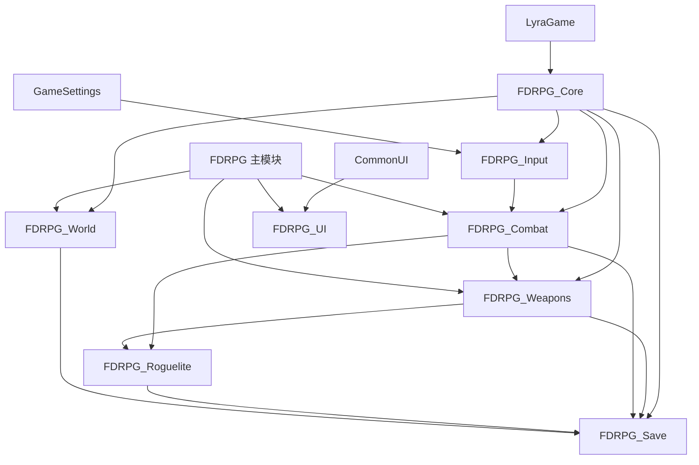
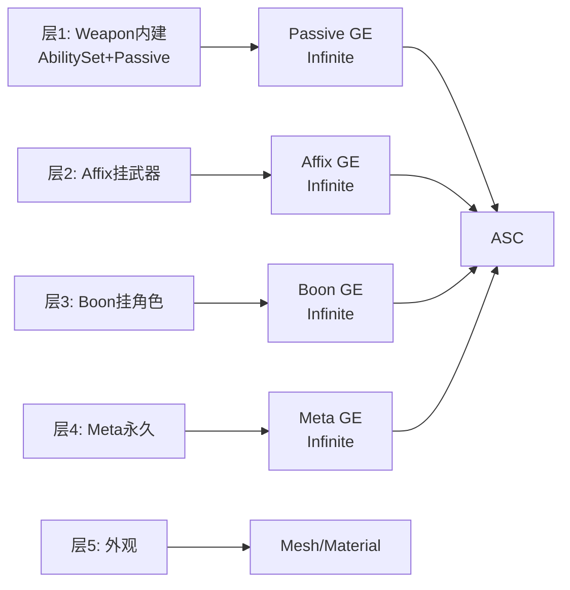

# 技术架构设计（v1 技术架构版）

> **文档定位**：从**策划骨架（05 文档）**到**代码实现**的技术桥梁文档。谈 UE 5.7 + Lyra 具体技术方案：GAS / ASC / GE / GA / AttributeSet / ModularGameplay / GameFeature / CommonUI / Experience / FastArraySerializer / EnhancedInput。
> **读者**：
> - 代码落地工程师（`ue-rpg-implementer`）
> - 各领域子 Agent（`gas-combat-expert` / `equipment-weapon-expert` / `rpg-persistence-expert` / `rpg-ui-expert`）
> - 主理人——验证技术路径可行性
>
> **不包含**：具体 C++ 函数体、具体数值（⏸️）、美术/内容。只到"接口声明 + 字段 + 类图 + 依赖 + 网络/性能注释"层。
> **版本**：v1（技术架构版，首稿）
> **日期**：2026-01
> **依赖文档**：01 / 02 v3.1 / 03 v1.1 / 04 / 05 v1 / 角色系统_属性_旧案.md
> **引擎基线**：**UE 5.7 + Lyra Sample（裁剪）** / C++ 主导 + BP 配置层 / PC 单机为主（保留网络能力）
>
> **⏸️ 本阶段工程原则**：只谈结构、类型、层级、字段、接口、依赖、策略。不谈具体数值、具体函数实现、美术内容。

---

## 目录

- [§1 架构总览与模块划分](#1-架构总览与模块划分)
- [§2 GAS 方案](#2-gas-方案)
- [§3 武器系统技术方案](#3-武器系统技术方案)
- [§4 输入与角色控制](#4-输入与角色控制)
- [§5 肉鸽强化五层技术方案](#5-肉鸽强化五层技术方案)
- [§6 存档系统技术方案](#6-存档系统技术方案)
- [§7 关卡与 Experience 技术方案](#7-关卡与-experience-技术方案)
- [§8 UI 技术方案（CommonUI）](#8-ui-技术方案commonui)
- [§9 模块与 Build.cs / .uplugin 配置](#9-模块与-buildcs--uplugin-配置)
- [§10 网络复制策略](#10-网络复制策略)
- [§11 性能预算](#11-性能预算)
- [§12 工具链与开发环境](#12-工具链与开发环境)
- [§13 风险清单与缓解](#13-风险清单与缓解)
- [§14 模块交付顺序建议](#14-模块交付顺序建议)
- [§15 变更日志](#15-变更日志)

---

## §1 架构总览与模块划分

### 1.1 基础架构原则

1. **Lyra 底座最小裁剪**：保留 Lyra 核心（ModularGameplay / Experience / GameFeature / AbilitySet / EquipmentManager / CommonUI），裁剪射击内容
2. **GameFeature 优先**：新增业务系统尽量以 GameFeature Plugin 承载
3. **C++ 基类 + Blueprint 配置**：战斗核心、网络复制、属性计算在 C++；武器/Boon/附魔/Meta 升级**全部 DataAsset**
4. **数据驱动 + 挂起字段预留**：内容通过 `UPrimaryDataAsset` + `UAssetManager` 异步加载
5. **单机优先，网络兼容**：Demo 本地单机，但保留 Lyra 复制骨架（`FFastArraySerializer` / `RepNotify` / Push Model）

### 1.2 现状说明（⚠️ 重要）

项目当前目录 `d:/UE_Work/FDRPG/RPG` 是一个**基础 UE5 GAS 项目**（非 Lyra 派生），已有 `URPGAttributeSet`（19 属性）、AbilitySystem/Weapon/AI 等半成品模块。

**迁移策略**：
- **不在现有项目上"打补丁"加 Lyra**（复杂度不可控）
- **新建 Lyra 派生项目作为基底**，现有 `URPGAttributeSet` 字段清单作为"需求参考"迁移进新架构（拆成 4 个 Lyra 风格小 AttributeSet）
- 现有武器/AI 代码可作为"业务逻辑草稿"在 implementer 阶段参考，但 Lyra 的 EquipmentManager / ExperienceDefinition 架构必须重建

### 1.3 Lyra 裁剪清单

| Lyra 模块 | 处理 |
|---|---|
| `LyraGame`（核心） | ✅ 保留继承 |
| `GameFeatures/ShooterCore` / `ShooterMaps` / `ShooterTests` | ❌ 移除 |
| `GameFeatures/CosmeticPlayer` | ⚠️ 保留作参考模板 |
| `ModularGameplayActors` / `GameFeatures` / `AsyncMixin` | ✅ 保留 |
| `CommonGame` / `CommonUI` / `CommonInput` / `CommonLoadingScreen` / `UIExtension` / `GameSettings` | ✅ 保留 |

### 1.4 项目模块划分

```
FDRPG.uproject
├── Source/
│   ├── FDRPG/                    # 主 Game Module（薄层：启动/Subsystem）
│   ├── FDRPG_Core/               # 公共 Tag/日志/基础结构/基类
│   ├── FDRPG_Combat/             # GAS 扩展/AttributeSet/伤害/能量/格挡
│   ├── FDRPG_Weapons/            # 武器定义/实例/仓库/装备/双形态
│   ├── FDRPG_Roguelite/          # Boon/附魔/Meta 强化
│   ├── FDRPG_Save/               # Meta/Run/快照/互传/自动存档
│   ├── FDRPG_World/              # 关卡/房间/Experience/RunContext
│   ├── FDRPG_UI/                 # HUD/面板/角色选择
│   └── FDRPG_Input/              # 输入配置/键位重映射
│
└── Plugins/GameFeatures/
    ├── RPGCore/                  # 基础（武器/Boon/附魔资产库）
    ├── RPGDungeon_01/            # 副本 1（可扩 N 个）
    ├── RPGHub/                   # 初始点枢纽
    └── RPGCosmetic/              # 外观（改自 CosmeticPlayer）
```

### 1.5 模块依赖图



### 1.6 关键架构决策摘要

| # | 决策 | 选择 | 舍弃方案 |
|---|---|---|---|
| A1 | Lyra 裁剪方式 | 保留 LyraGame + 移除 Shooter* | 从零写/保留全部 |
| A2 | 模块组织 | 8 Game Module + N GameFeature | 单巨模块/全 GameFeature |
| A3 | 属性系统 | 扩展 `ULyraHealthSet` + 4 个新 Set | 单一大 AttributeSet |
| A4 | 武器模型 | 扩展 Lyra EquipmentDefinition/Instance | 自建 WeaponComponent |
| **A5** | **大招池归属** | **`URPGWeaponInstance::CurrentUltEnergy` UObject 字段（非 AttributeSet）** | 放 AttributeSet 会破坏"跟武器走"语义 |
| A6 | 武器仓库 | `URPGWeaponStorage` + 独立 Meta 序列化 | 放 ASC |
| A7 | 多角色档案 | `URPGRootSaveGame` 持 `Map<FGuid,FileName>`，每角色独立文件 | 单角色单槽 |
| A8 | 存档触发 | 存档点手动 + 事件驱动自动存档双通道 | 仅手动 |
| A9 | 肉鸽 Modifier 出口 | 统一用 `UGameplayEffect` + SetByCaller | 自建 Modifier 系统 |
| A10 | 关卡切换 | Lyra Experience + LevelStreaming（房间） | OpenLevel/World Partition |

---

## §2 GAS 方案

### 2.1 ASC 归属

| 项 | 选择 |
|---|---|
| ASC 持有者 | `APlayerState`（玩家）/ `APawn`（AI）——Lyra 标准 |
| ASC 子类 | `URPGAbilitySystemComponent : public ULyraAbilitySystemComponent` |
| ASC 接口 | `IAbilitySystemInterface` |
| 复制模式 | 玩家 `Mixed`（默认），AI `Minimal` |

### 2.2 AttributeSet 划分（多小 Set）

| AttributeSet | 继承 | 字段 | 说明 |
|---|---|---|---|
| `ULyraHealthSet`（复用） | `ULyraAttributeSet` | Health/MaxHealth/Healing/Damage | Damage→-Health 元属性管线 |
| `ULyraCombatSet`（复用） | `ULyraAttributeSet` | BaseDamage/BaseHeal | — |
| `URPGPrimarySet` | `ULyraAttributeSet` | Hp_Basic/Atk_Basic/Def_Basic + Hp_PostAdd/Atk_PostAdd/Def_PostAdd + Hp_Mul/Atk_Mul/Def_Mul | 旧案 9 字段 |
| `URPGSecondarySet` | `ULyraAttributeSet` | Crit/CritDmg/IgnDef/BreakBonus/Dmg_Mul/DmgRed_Mul/HealthSteal/NormalSkillSpeed/MoveSpeed/**EnergyGainMul**（旧 PowerRegenRate 改名） | 战斗派生 |
| `UEnergySet` | `ULyraAttributeSet` | SwitchEnergy/MaxSwitchEnergy | **⚠️ 仅切换池，大招池不在这里** |
| `UBlockSet` | `ULyraAttributeSet` | BlockDurability/BlockMax/BlockRegenDelay/BlockRegenRate/**BlockRegenRate_InCombat**（预留默认 0） | 格挡耐久 |
| `UManaSet`（⏸️） | `ULyraAttributeSet` | Mana/MaxMana/ManaRegen | Demo 暂不用 |

> **⚠️ 大招池不进 AttributeSet（核心决策）**：大招池跟随 WeaponInstance、换装即清空、参与 Run 档序列化。放 AttributeSet 会违反"能量跟着武器走"的哲学，也无法跟 WeaponInstance 一起序列化。
>
> **方案**：`URPGWeaponInstance::CurrentUltEnergy` 直接作 `UPROPERTY(Replicated)` 字段；HUD 从 `EquipmentManager.GetMainHandWeapon()->GetUltEnergy()` 读取。

### 2.3 GameplayAbility 基类

| 类 | 继承 | 归属 |
|---|---|---|
| `URPGGameplayAbility` | `ULyraGameplayAbility` | FDRPG_Combat |
| `URPGGameplayAbility_FromEquipment` | `ULyraGameplayAbility_FromEquipment` | FDRPG_Weapons |
| `URPGAbility_NormalAttack` | `URPGGameplayAbility_FromEquipment` | FDRPG_Weapons（仅主手激活） |
| `URPGAbility_WeaponSkill` | `URPGGameplayAbility_FromEquipment` | FDRPG_Weapons（Q/W/E/R 通用） |
| `URPGAbility_Ultimate` | `URPGGameplayAbility_FromEquipment` | FDRPG_Weapons |
| `URPGAbility_SwitchWeapon` | `URPGGameplayAbility` | FDRPG_Weapons |
| `URPGAbility_SwitchIn / SwitchOut` | `URPGGameplayAbility_FromEquipment` | FDRPG_Weapons |
| `URPGAbility_Dodge` | `URPGGameplayAbility` | FDRPG_Combat |
| `URPGAbility_Block` | `URPGGameplayAbility` | FDRPG_Combat |
| `URPGAbility_UseConsumable` | `URPGGameplayAbility` | FDRPG_Combat |
| `URPGAbility_Interact` | `URPGGameplayAbility` | FDRPG_World |
| `URPGAbility_Death` | `ULyraGameplayAbility_Death` | FDRPG_Combat |

### 2.4 关键 GA API 草案

```cpp
UCLASS(Abstract)
class FDRPG_WEAPONS_API URPGGameplayAbility_FromEquipment
    : public ULyraGameplayAbility_FromEquipment
{
    GENERATED_BODY()
public:
    UFUNCTION(BlueprintPure) URPGWeaponInstance* GetRPGWeaponInstance() const;
    UFUNCTION(BlueprintPure) FRPGWeaponMultipliers GetCurrentMultipliers() const;
    UPROPERTY(EditDefaultsOnly) bool bMainHandOnly = false;
protected:
    virtual bool CanActivateAbility(/*...*/) const override;
};

UCLASS()
class FDRPG_WEAPONS_API URPGAbility_Ultimate : public URPGGameplayAbility_FromEquipment
{
public:
    virtual bool CheckCost(/*...*/) const override;   // [Server] UltEnergy>=UltCost
    virtual void ApplyCost(/*...*/) const override;   // [Server] UltEnergy-=UltCost
    UPROPERTY(EditDefaultsOnly) float UltCost = 100.f;  // ⏸️
};

UCLASS()
class FDRPG_COMBAT_API URPGAbility_Block : public URPGGameplayAbility
{
public:
    UPROPERTY(EditDefaultsOnly) float PerfectBlockWindow = 0.3f;  // ⏸️
    UFUNCTION() FRPGBlockResult OnDamagePrevented(const FGameplayEffectSpec& Spec);
protected:
    float AbilityActivatedTime = 0.f;
};
```

### 2.5 AbilitySet 结构

| AbilitySet | 归属 | 内容 |
|---|---|---|
| `URPGCharacterBaseAbilitySet` | RPGCore GameFeature | Dodge/Block/Interact/UseConsumable/SwitchWeapon/Death |
| `URPGWeaponAbilitySet_MainHand` | WeaponDefinition 内 | Q/W/NA/Ult/SwitchOut + MainHandPassive GE |
| `URPGWeaponAbilitySet_OffHand` | WeaponDefinition 内 | E/R/SwitchIn + OffHandPassive GE |

### 2.6 GameplayEffect 清单

| GE | 用途 | 特点 |
|---|---|---|
| `GE_Damage_Instant` | 伤害结算 | 使用 `URPGDamageExecution` |
| `GE_UltEnergy_Add_Dynamic` | 大招池加算 | SetByCaller `Data.UltEnergy.Delta`；GA 末尾按 WeaponInstance 调 `AddUltEnergy` |
| `GE_SwitchEnergy_Add_Dynamic` | 切换池加算 | Modifier 作用 `UEnergySet.SwitchEnergy` |
| `GE_Buff_PerfectBlock` | 完美格挡 Buff | Duration 5s，`RPG.Buff.PerfectBlock` Tag |
| `GE_Cooldown_*` | 技能冷却 | Lyra 标准 Cooldown |
| `GE_Cost_SwitchEnergy_50` | 满切消耗 | `UEnergySet.SwitchEnergy -50` |
| `GE_Immunity_DodgeIFrames` | 闪避无敌帧 | `RPG.State.Dodging` Tag，伤害 GE 检查免疫 |
| `GE_Status_BlockBroken_Stun` | 格挡破防硬直 | Duration 1.2s，禁用 Block/Dodge |

### 2.7 GameplayCue 分层

| Tag | Notify |
|---|---|
| `Cue.Combat.Hit.Normal` / `Hit.Crit` | 命中特效 |
| `Cue.Combat.Block.Normal` / `Block.Perfect` | 格挡金光 |
| `Cue.Combat.Dodge.Normal` / `Dodge.Perfect` | 闪避 |
| `Cue.Combat.Ultimate.Release` | 大招释放 |
| `Cue.Weapon.Switch.Bare` / `Switch.Full` | 裸切/满切 |
| `Cue.Death.Player` | 玩家死亡 |
| `Cue.UI.DamageNumber` | 飘字（IndicatorSystem） |

> 每个 GameFeature 通过 `UGameFeatureAction_AddGameplayCuePath` 注册 Cue 路径。

### 2.8 DamageExecution：旧案 13 步伤害公式

`URPGDamageExecution : UGameplayEffectExecutionCalculation`（归属 FDRPG_Combat）

```
Step 1~3: 最终 Hp/Atk/Def = 基础*(1+%)+额外
Step 4~5: 读 Crit / CritDmg
Step 6  : 暴击判定（FRandomStream，种子来自 RunContext）
Step 7  : 技能倍率（SetByCaller + 武器 Main/Off Multipliers）
Step 8  : 承伤率 = 500/(500+防御*(1-IgnDef))
Step 9  : 充能 = 基础充能*(1+EnergyGainMul) → 附加 GE 给 WeaponInstance.UltEnergy + UEnergySet.SwitchEnergy
Step 10 : 韧性减少 = 基础破韧*(1+BreakBonus)
Step 11 : 最终伤害 = 未减免 * 承伤率 * (1+Dmg_Mul) * (1-DmgRed_Mul)
Step 12 : 吸血 = 实际伤害 * HealthSteal（附加 GE 给 Source 回血）
Step 13 : Output Modifier → ULyraHealthSet.Damage（复用 Lyra 管线）
```

**关键点**：
- Step 13 输出到 `ULyraHealthSet.Damage` 元属性 → 衔接 Lyra 原生死亡 + OnOutOfHealth
- Step 9 充能不在 Execution 内直接改池子，而是通过附加 GE 把 Delta 传给 Instigator 的 GA，GA 在 `EndAbility` 调 `WeaponInstance.AddUltEnergy`
- **同目标递减 / AOE 上限**：DamageExecution 开头查询 Target 上的 `URPGCombatRecorderComponent`

### 2.9 技能消耗与冷却

| 机制 | 实现 |
|---|---|
| 大招消耗（100） | `URPGAbility_Ultimate::ApplyCost` 直接改 `WeaponInstance.UltEnergy`（非 GE） |
| 切换池消耗（满切 50） | `GE_Cost_SwitchEnergy_50`（Lyra 标准 Cost） |
| 技能 CD | Lyra 标准 Cooldown GE + `Cooldown.Skill.Q` Tag |
| 能量无时间恢复 | **不给任何 Regen GE**，事件驱动 |
| 格挡耐久战内不回 | `URPGBlockRegenComponent` 监听 `RPG.State.InCombat` Tag，仅脱战 Tick |

---

## §3 武器系统技术方案

### 3.1 类层级

```
ULyraEquipmentDefinition (Lyra)
    └── URPGWeaponDefinition (FDRPG_Weapons)

ULyraEquipmentInstance (Lyra)
    └── URPGWeaponInstance (FDRPG_Weapons)
         - IRPGSerializable

ULyraEquipmentManagerComponent (Lyra)
    └── URPGEquipmentManagerComponent (FDRPG_Weapons)

UObject
    └── URPGWeaponStorage (FDRPG_Save)  // Meta 档武器仓库
```

### 3.2 URPGWeaponDefinition

```cpp
UCLASS()
class FDRPG_WEAPONS_API URPGWeaponDefinition : public ULyraEquipmentDefinition
{
    GENERATED_BODY()
public:
    UPROPERTY(EditDefaultsOnly) FName WeaponID;
    UPROPERTY(EditDefaultsOnly) FText DisplayName;  // ⏸️
    UPROPERTY(EditDefaultsOnly) ERPGWeaponCategory WeaponCategory;
    UPROPERTY(EditDefaultsOnly) FGameplayTag AnimLayerTag;

    // 双形态（F.7 扩展约束：两份独立数组）
    UPROPERTY(EditDefaultsOnly) TObjectPtr<ULyraAbilitySet> MainHandAbilitySet;
    UPROPERTY(EditDefaultsOnly) TObjectPtr<ULyraAbilitySet> OffHandAbilitySet;
    UPROPERTY(EditDefaultsOnly) FRPGWeaponMultipliers MainHandMultipliers;
    UPROPERTY(EditDefaultsOnly) FRPGWeaponMultipliers OffHandMultipliers;

    UPROPERTY(EditDefaultsOnly) int32 AffixSlots = 2;
    UPROPERTY(EditDefaultsOnly) FRPGBaseAttributes BaseAttributes;  // ⏸️ 数值
};

USTRUCT(BlueprintType)
struct FRPGWeaponMultipliers
{
    GENERATED_BODY()
    UPROPERTY(EditDefaultsOnly) float Damage = 1.0f;
    UPROPERTY(EditDefaultsOnly) float Range = 1.0f;
    UPROPERTY(EditDefaultsOnly) float Cooldown = 1.0f;
    UPROPERTY(EditDefaultsOnly) float Cost = 1.0f;
};
```

### 3.3 URPGWeaponInstance（⚠️ 核心序列化节点）

```cpp
UCLASS(BlueprintType)
class FDRPG_WEAPONS_API URPGWeaponInstance
    : public ULyraEquipmentInstance, public IRPGSerializable
{
    GENERATED_BODY()
public:
    UPROPERTY(VisibleAnywhere, Replicated) FName SourceDefinitionID;  // 用 ID 序列化
    UPROPERTY(VisibleAnywhere, Replicated) FGuid InstanceGuid;

    UPROPERTY(VisibleAnywhere, ReplicatedUsing = OnRep_UltEnergy, BlueprintReadOnly)
    float CurrentUltEnergy = 0.f;

    UPROPERTY(VisibleAnywhere, Replicated, BlueprintReadOnly)
    TArray<FRPGAffixInstance> EquippedAffixes;

    UPROPERTY(VisibleAnywhere, Replicated) int32 RuntimeSeed = 0;

    UFUNCTION(BlueprintPure) URPGWeaponDefinition* GetDefinition() const;
    UFUNCTION(BlueprintCallable) void AddUltEnergy(float Delta);
    UFUNCTION(BlueprintCallable) void ResetUltEnergy();
    UFUNCTION(BlueprintPure) bool IsUltReady() const;

    DECLARE_MULTICAST_DELEGATE_TwoParams(FOnUltEnergyChanged, URPGWeaponInstance*, float);
    FOnUltEnergyChanged OnUltEnergyChanged;

    virtual void SerializeForSave(FRPGSaveArchive& Ar) override;
    virtual void DeserializeForLoad(FRPGSaveArchive& Ar) override;

protected:
    UFUNCTION() void OnRep_UltEnergy();
};
```

> **序列化关键**：`SourceDefinitionID` 用 FName（不存硬路径），加载时 `UAssetManager` 按 `FPrimaryAssetId("RPGWeaponDefinition", WeaponID)` 异步加载 Definition。

### 3.4 URPGEquipmentManagerComponent API

```cpp
UCLASS()
class FDRPG_WEAPONS_API URPGEquipmentManagerComponent
    : public ULyraEquipmentManagerComponent
{
public:
    // [Server] 装备管线
    UFUNCTION(BlueprintCallable) URPGWeaponInstance* EquipWeaponToMainHand(URPGWeaponInstance* Inst);
    UFUNCTION(BlueprintCallable) URPGWeaponInstance* EquipWeaponToOffHand(URPGWeaponInstance* Inst);
    UFUNCTION(BlueprintCallable) URPGWeaponInstance* UnequipMainHand(bool bReturnToStorage);
    UFUNCTION(BlueprintCallable) URPGWeaponInstance* UnequipOffHand(bool bReturnToStorage);

    // [Server] F 切换
    UFUNCTION(BlueprintCallable) void SwapHands();

    UFUNCTION(BlueprintPure) URPGWeaponInstance* GetMainHandWeapon() const;
    UFUNCTION(BlueprintPure) URPGWeaponInstance* GetOffHandWeapon() const;

    DECLARE_MULTICAST_DELEGATE_TwoParams(FOnWeaponEquipped, EEquipSlot, URPGWeaponInstance*);
    DECLARE_MULTICAST_DELEGATE_TwoParams(FOnWeaponUnequipped, EEquipSlot, URPGWeaponInstance*);
    DECLARE_MULTICAST_DELEGATE(FOnWeaponsSwapped);

protected:
    UPROPERTY(Replicated) FRPGEquipmentList EquipmentList;  // FFastArraySerializer
    TWeakObjectPtr<URPGWeaponInstance> MainHandCache;
    TWeakObjectPtr<URPGWeaponInstance> OffHandCache;

    void HandleSwapBare();   // 互换槽位 + 重绑 AbilitySet
    void HandleSwapFull();   // 裸切 + Apply Cost GE + 触发 SwitchOut(旧主) + SwitchIn(新主)
};
```

### 3.5 装备/卸下/切换三条管线对照表

| 事件 | ASC 操作 | WeaponInstance | 广播 |
|---|---|---|---|
| 装备主槽 | Give(MainHandSet) | 新建 UltEnergy=0 / 从仓库取保留值 | OnWeaponEquipped(Main) |
| 装备副槽 | Give(OffHandSet) | 同上 | OnWeaponEquipped(Off) |
| 卸下主手（丢弃） | Take(MainHandSet) | `ResetUltEnergy()` + Destroy | OnWeaponUnequipped |
| 卸下主手（返仓） | Take(MainHandSet) | 保留 UltEnergy + 放回 URPGWeaponStorage | 同上 |
| F 裸切 | Take 两套 + Give 互换后的两套 | 两 UltEnergy **不变** | OnWeaponsSwapped |
| F 满切 | 裸切操作 + Cost GE + SwitchOut/In GA | 两 UltEnergy 不变 | OnWeaponsSwapped |

### 3.6 武器仓库

```cpp
UCLASS()
class FDRPG_SAVE_API URPGWeaponStorage : public UObject
{
public:
    UPROPERTY(VisibleAnywhere) TArray<TObjectPtr<URPGWeaponInstance>> Weapons;

    UFUNCTION(BlueprintCallable) URPGWeaponInstance* AddByDefinition(FName DefID);
    UFUNCTION(BlueprintCallable) bool Remove(URPGWeaponInstance* Inst);
    UFUNCTION(BlueprintCallable) URPGWeaponInstance* FindByGuid(const FGuid& Guid) const;
    void SerializeForMeta(FRPGSaveArchive& Ar);
};
```

### 3.7 双形态乘子实现（F.7 扩展约束）

1. `URPGAbility_WeaponSkill::ActivateAbility` 调 `GetCurrentMultipliers()` → 按 WeaponInstance 槽位返回 Main/Off
2. SetByCaller 注入 Damage GE：`SpecHandle.Data->SetSetByCallerMagnitude(Tag_Data_Damage_WeaponMultiplier, Mult.Damage)`
3. DamageExecution Step 7 读取

**升级路径**：
- Demo → v1.0：两份 AbilitySet 填不同资产 → **0 代码改动**
- v1.0 → Aspect：新增 `TArray<FRPGWeaponAspect>` + `CurrentAspectIndex`，不改底层

---

## §4 输入与角色控制

### 4.1 角色类层级

```
ALyraCharacter (AModularCharacter 派生)
    └── ARPGCharacter (FDRPG_Core)
         - URPGEquipmentManagerComponent
         - URPGRunStateComponent
         - URPGInteractionComponent
         - URPGCombatRecorderComponent
```

> ASC 仍挂 `APlayerState`（Lyra 标准）。

### 4.2 EnhancedInput 资产

| 资产 | 类型 |
|---|---|
| `IMC_Default_Keyboard` | UInputMappingContext（方向键+字母键 v3 键位） |
| `IMC_Default_Gamepad` | UInputMappingContext（Xbox 映射 F.8） |
| `IMC_WASD_Preset` | UInputMappingContext |
| `InputConfig_Default` | ULyraInputConfig（IA ↔ InputTag） |

### 4.3 InputAction / InputTag

| IA | Tag | GA |
|---|---|---|
| IA_Move | `InputTag.Move` | Native（角色移动函数） |
| IA_NormalAttack | `InputTag.Ability.NormalAttack` | RPGAbility_NormalAttack |
| IA_Skill_Q/W | `InputTag.Ability.MainSkill1/2` | Weapon.MainHandAbilitySet |
| IA_Skill_E/R | `InputTag.Ability.OffSkill1/2` | Weapon.OffHandAbilitySet |
| IA_Ultimate | `InputTag.Ability.Ultimate` | Weapon.MainHandAbilitySet Ult |
| IA_Dodge/Block/SwitchWeapon/Interact/Consumable | `InputTag.Ability.*` | 对应 GA |
| IA_Pause/OpenInventory | `InputTag.UI.*` | UIInput |

### 4.4 InputTag → GA 绑定

复用 Lyra `AbilityInputTagPressed/Released`：
1. `GiveAbilitySet` 把 GA 的 DynamicAbilityTags 打上 InputTag
2. `ULyraHeroComponent::Input_AbilityInputTagPressed` → ASC → 遍历 Spec 匹配 → TryActivate
3. 切换时 Take 旧 + Give 新 → InputTag 自然随 Spec 变化

### 4.5 移动与朝向

- `bUseControllerRotationYaw = false`
- `CharacterMovement->bOrientRotationToMovement = true`
- `CharacterMovement->RotationRate = FRotator(0, 720, 0)`
- 不按方向键自然保留上次朝向

### 4.6 普攻自动锁敌辅助

`URPGAbility_NormalAttack::ActivateAbility`：
1. `ULyraTeamSubsystem::CanCauseDamage` 过滤 → 找 5m 内最近敌对 Pawn
2. 找到 → 0.1s 朝向插值 → 出招
3. 无目标 → 当前朝向

### 4.7 键位重映射（P0）

基于 Lyra GameSettings：
- IA 勾选 `bMapped = true`
- 设置菜单调 `UEnhancedInputLocalPlayerSubsystem::AddPlayerMappedKey`
- 存 `ULyraSettingsLocal`（Meta 档 GlobalSettings 子字段）

### 4.8 格挡按住与完美格挡判定

1. Block GA 激活（D 按下）→ 给角色打 `RPG.State.Blocking` Tag + 启动 0.3s Timer
2. Timer 未到期受击 → 伤害 GE PreExecute 检查 `RPG.Buff.PerfectBlockWindow` Tag → 判完美
3. Timer 到期 → `PerfectBlockWindow` Tag 移除，保留 `Blocking`（普通格挡耗耐久）
4. D 松开 → EndAbility，移除 `Blocking`

---

## §5 肉鸽强化五层技术方案

### 5.1 统一效果出口：GameplayEffect

五层效果**全部**转化为 GameplayEffect 作用到 ASC 或 WeaponInstance。**不自建 Modifier 系统**。



### 5.2 层 1 武器内建

- 数据：`URPGWeaponDefinition.MainHandAbilitySet/OffHandAbilitySet` 里的 `FLyraAbilitySet_GameplayEffect`
- 装备时 `GiveToAbilitySystem` → 自动应用 Infinite GE
- 卸下时 `TakeFromAbilitySystem` → 自动移除

### 5.3 层 2 附魔

```cpp
UCLASS()
class FDRPG_ROGUELITE_API URPGAffixDefinition : public UPrimaryDataAsset
{
public:
    UPROPERTY(EditDefaultsOnly) FName AffixID;
    UPROPERTY(EditDefaultsOnly) ERPGRarity Rarity;
    UPROPERTY(EditDefaultsOnly) ERPGAffixScope Scope;
    UPROPERTY(EditDefaultsOnly) TSoftClassPtr<UGameplayEffect> ModifierGE;
    UPROPERTY(EditDefaultsOnly) TMap<FGameplayTag, float> SetByCallerMagnitudes;  // ⏸️
    UPROPERTY(EditDefaultsOnly) FGameplayTag ExclusiveGroupTag;
};

USTRUCT(BlueprintType)
struct FRPGAffixInstance
{
    UPROPERTY() FName SourceAffixID;
    UPROPERTY() int32 RollSeed;
    UPROPERTY(NotReplicated) FActiveGameplayEffectHandle AppliedHandle;
};
```

**挂载**：`OnWeaponEquipped/Unequipped` 回调中对每个 AffixInstance 按 Scope 应用/撤销 GE。

### 5.4 层 3 Boon

结构类似 Affix，作用目标为角色 ASC。生命周期本 Run，序列化进 Run 档，回档按 Snapshot 重新应用。

```cpp
UCLASS()
class FDRPG_ROGUELITE_API URPGBoonManagerComponent : public UControllerComponent
{
public:
    UFUNCTION(BlueprintCallable) FRPGBoonInstance AcquireBoon(URPGBoonDefinition* Def);
    UFUNCTION(BlueprintCallable) bool DiscardBoon(const FGuid& InstanceID);  // 05 §12 Q#3
    UFUNCTION(BlueprintPure)  TArray<FRPGBoonInstance> GetActiveBoons() const;
};
```

### 5.5 层 4 Meta 强化

永久，归 Meta 档。

```cpp
UCLASS()
class FDRPG_ROGUELITE_API URPGMetaUpgradeDefinition : public UPrimaryDataAsset
{
public:
    UPROPERTY(EditDefaultsOnly) FName MetaUpgradeID;
    UPROPERTY(EditDefaultsOnly) int32 MaxLevel;
    UPROPERTY(EditDefaultsOnly) TSoftObjectPtr<UCurveTable> CostCurve;
    UPROPERTY(EditDefaultsOnly) TArray<TSoftClassPtr<UGameplayEffect>> EffectPerLevel;
    UPROPERTY(EditDefaultsOnly) TArray<FName> PrerequisiteMetaIDs;
};
```

**应用**：角色 Possess / Experience Ready / Meta 读档时，`URPGMetaProgressionSubsystem` 遍历 OwnedMetaUpgrades 应用对应 Level 的 Infinite GE。

### 5.6 层 5 外观

- `GameFeature: RPGCosmetic`（改自 Lyra CosmeticPlayer）
- `UGameFeatureAction_AddComponents` 加 `UControllerComponent_CharacterParts`
- 数据 `URPGCosmeticDefinition`（Mesh/AnimBP/Material/SFX）

### 5.7 Modifier 聚合原则

| 情况 | 方式 |
|---|---|
| 同属性多加法 | GAS 自动累加 |
| 先加后乘 | `EGameplayModEvaluationChannel` 分 Channel |
| 条件触发 | Aggregator + `FGameplayTagRequirements` |
| 互斥组 | 添加前检查 `ExclusiveGroupTag` 替换 |

---

## §6 存档系统技术方案

> 由 `rpg-persistence-expert` 深度参与落地。**技术上最复杂的系统**。

### 6.1 顶层存档结构

```
Saved/SaveGames/
    ├── RPG_Root.sav                      # URPGRootSaveGame（顶层）
    ├── RPG_Character_{GUID}.sav          # URPGCharacterSaveData（每角色）
    └── RPG_Character_{GUID}.sav.bak      # 原子写入备份
```

### 6.2 URPGRootSaveGame

```cpp
UCLASS()
class FDRPG_SAVE_API URPGRootSaveGame : public USaveGame
{
public:
    UPROPERTY() int32 SchemaVersion = 1;
    UPROPERTY() FRPGGlobalSettings GlobalSettings;  // KeyBindings/Audio/Video
    UPROPERTY() TMap<FGuid, FString> CharacterIndex;
    UPROPERTY() FGuid ActiveCharacterID;
    UPROPERTY() FDateTime LastSaveTime;
};
```

### 6.3 URPGCharacterSaveData

```cpp
UCLASS()
class FDRPG_SAVE_API URPGCharacterSaveData : public USaveGame
{
public:
    UPROPERTY() int32 SchemaVersion = 1;
    UPROPERTY() FGuid CharacterID;
    UPROPERTY() FText CharacterName;  // ⏸️
    UPROPERTY() FDateTime CreatedAt;

    UPROPERTY() FRPGMetaData Meta;                                // 不回滚
    UPROPERTY() TMap<FName, FRPGRunSnapshot> SavePointSnapshots;  // 按存档点 ID
    UPROPERTY() FName LastActiveSavePointID;
    UPROPERTY() FRPGRunSnapshot AutoSaveSnapshot;
    UPROPERTY() bool bHasActiveRun = false;
};

USTRUCT()
struct FRPGMetaData
{
    UPROPERTY() TMap<FName, int32> OwnedMetaUpgrades;
    UPROPERTY() TSet<FName> UnlockedWeapons;
    UPROPERTY() TSet<FName> UnlockedDungeons;
    UPROPERTY() TArray<FRPGSavePointRecord> SavePointsUnlocked;  // 互传数据源（05 §13 Q6）
    UPROPERTY() TMap<FName, int32> StoryFlags;
    UPROPERTY() TMap<FName, int32> AchievementProgress;
    UPROPERTY() TSet<FName> EnemyCodex;
    UPROPERTY() int32 TotalDeathCount = 0;
    UPROPERTY() int32 TotalRunCount = 0;
    UPROPERTY() int32 TotalKillCount = 0;
    UPROPERTY() FRPGCurrencyBag PermanentCurrency;
    UPROPERTY() TSet<FName> OwnedCosmetics;
    UPROPERTY() TArray<FRPGWeaponSaveEntry> WeaponStorage;  // 武器仓库
};
```

### 6.4 FRPGRunSnapshot

```cpp
USTRUCT()
struct FRPGRunSnapshot
{
    UPROPERTY() int32 SchemaVersion = 1;
    UPROPERTY() FDateTime CapturedAt;
    UPROPERTY() FName SavePointID;

    // 角色状态
    UPROPERTY() float CurrentHealth;   UPROPERTY() float MaxHealth;
    UPROPERTY() float CurrentMana;     UPROPERTY() float MaxMana;
    UPROPERTY() float SwitchEnergy;
    UPROPERTY() float BlockDurability;
    UPROPERTY() int32 Level;           UPROPERTY() float Experience;
    UPROPERTY() TMap<FName, float> PrimaryAttributes;
    UPROPERTY() TMap<FName, float> SecondaryAttributes;
    UPROPERTY() TArray<FRPGActiveEffectSaveEntry> ActiveEffects;

    // 装备（含池值）
    UPROPERTY() FRPGWeaponSaveEntry EquippedMainWeapon;
    UPROPERTY() FRPGWeaponSaveEntry EquippedOffWeapon;

    // 背包/货币（Run 内）
    UPROPERTY() TArray<FRPGInventoryEntry> Inventory;
    UPROPERTY() FRPGCurrencyBag RunCurrency;

    UPROPERTY() TArray<FRPGBoonSaveEntry> AcquiredBoons;

    // 关卡
    UPROPERTY() FName CurrentDungeonID;
    UPROPERTY() FName CurrentRoomID;
    UPROPERTY() TMap<FName, int32> RoomRandomSeeds;
    UPROPERTY() TSet<FName> KilledEliteIDs;
    UPROPERTY() TSet<FName> OpenedChests;
    UPROPERTY() TSet<FName> ActivatedAltars;

    // 统计
    UPROPERTY() int32 RunKillCount; UPROPERTY() int32 RunDeathCount;
    UPROPERTY() float RunElapsedTime;

    // NPC
    UPROPERTY() TMap<FName, int32> DialogChoices;
    UPROPERTY() TMap<FName, float> NPCDispositionLocal;
    UPROPERTY() TMap<FName, int32> QuestProgressLocal;
};

USTRUCT()
struct FRPGWeaponSaveEntry
{
    UPROPERTY() FName SourceDefinitionID;
    UPROPERTY() FGuid InstanceGuid;
    UPROPERTY() float CurrentUltEnergy;
    UPROPERTY() int32 RuntimeSeed;
    UPROPERTY() TArray<FRPGAffixSaveEntry> Affixes;
};
```

### 6.5 URPGSaveSubsystem

```cpp
UCLASS()
class FDRPG_SAVE_API URPGSaveSubsystem : public UGameInstanceSubsystem
{
public:
    virtual void Initialize(FSubsystemCollectionBase&) override;

    // 角色档
    UFUNCTION(BlueprintCallable) FGuid CreateNewCharacter(FText Name);
    UFUNCTION(BlueprintCallable) bool LoadCharacter(const FGuid& CharacterID);
    UFUNCTION(BlueprintCallable) bool DeleteCharacter(const FGuid& CharacterID);
    UFUNCTION(BlueprintPure)     TArray<FRPGCharacterMetaInfo> ListCharacters() const;

    // Meta 写入（原子、事件驱动）
    UFUNCTION(BlueprintCallable) void WriteMetaAsync(TFunction<void(bool)> OnComplete);

    // 手动存档点
    UFUNCTION(BlueprintCallable) void CaptureSnapshotAtSavePoint(FName SavePointID);
    UFUNCTION(BlueprintCallable) void LoadSnapshot(FName SavePointID);
    UFUNCTION(BlueprintCallable) void LoadLastActiveSnapshot();  // 死亡回档入口

    // 自动存档
    UFUNCTION(BlueprintCallable) void TriggerAutoSave(ERPGAutoSaveReason Reason);
    UFUNCTION(BlueprintCallable) void LoadAutoSave();

    // 互传（不写快照）
    UFUNCTION(BlueprintCallable) bool TeleportToSavePoint(FName SavePointID);

protected:
    bool AtomicWriteSave(USaveGame* Save, const FString& Path);
    void CaptureSnapshotAsync(FName SavePointID, TFunction<void(FRPGRunSnapshot)> OnDone);
};

UENUM()
enum class ERPGAutoSaveReason : uint8
{
    RoomEntered, LevelChanged, GameExit, MetaUnlock, CustomEvent
};
```

### 6.6 存档点 Actor

```cpp
UCLASS()
class FDRPG_WORLD_API ARPGSavePointActor : public AActor, public IInteractableTarget
{
public:
    UPROPERTY(EditAnywhere) FName SavePointID;
    UPROPERTY(EditAnywhere) FName DungeonID;
    UPROPERTY(EditAnywhere) FText DisplayName;  // ⏸️
    UPROPERTY(EditAnywhere) bool bIsHub = false;

    virtual void GatherInteractionOptions(const FInteractionQuery&, FInteractionOptionBuilder&) override;
    // "存档" → CaptureSnapshotAtSavePoint
    // "快速旅行" → 打开互传 UI
};
```

### 6.7 死亡回档流程

```
ULyraHealthSet.OnOutOfHealth
  → ULyraHealthComponent::HandleOutOfHealth → GameplayEvent.Death
  → URPGAbility_Death 激活
     → StartDeath (Tag: Status.Death.Dying) + 动画 + Cue.Death.Player
     → FinishDeath (Tag: Status.Death.Dead)
  → URPGRespawnManager::OnDeathFinished（监听委托）
     → UI 淡黑 (CommonLoadingScreen)
     → Meta.TotalDeathCount++ + WriteMetaAsync
     → URPGSaveSubsystem::LoadLastActiveSnapshot
        → 读 Snapshot
        → 若 CurrentDungeonID 变化 → 切 Experience
        → RestoreCharacter(Snapshot)
            - ASC.ClearAllGE
            - 还原 AttributeSet（按 Primary/Secondary Map）
            - EquipmentManager 还原（从仓库/异步加载 Definition + 创建实例）
            - WeaponInstance.CurrentUltEnergy 还原
            - UEnergySet.SwitchEnergy / UBlockSet.BlockDurability 还原
            - BoonManager 重应用 AcquiredBoons
            - Inventory/Currency 还原
            - RunStateComponent 还原 RoomRandomSeeds
        → Possess + UI 淡入
```

### 6.8 自动存档触发

| Reason | 事件 | 槽位 |
|---|---|---|
| RoomEntered | `URPGRoomManager::OnRoomEntered` | AutoSaveSnapshot |
| LevelChanged | `ULyraExperienceManager::OnExperienceLoaded` | AutoSaveSnapshot |
| GameExit | `UGameInstance::Shutdown` | AutoSaveSnapshot |
| MetaUnlock | 解锁新武器/存档点 | 仅 Meta |

> 自动存档**与手动分离**，死亡只回手动快照（`LastActiveSavePointID`），AutoSaveSnapshot 用于"意外崩溃恢复"。

### 6.9 WeaponInstance 序列化策略（⚠️ 焦点）

**挑战**：WeaponInstance 同时是场景复制对象 + Run 档序列化单元 + 仓库 Meta 序列化单元。

**方案**：
1. 不直接序列化 UObject，用 `FRPGWeaponSaveEntry` 中间结构
2. 关键字段：`SourceDefinitionID`(FName) + `InstanceGuid`(FGuid) + `CurrentUltEnergy` + `RuntimeSeed` + `Affixes[]`
3. 读档：`URPGWeaponFactory::CreateInstance(entry)`：
   - `UAssetManager::GetStreamableManager().RequestAsyncLoad(PrimaryAssetId)`
   - 加载完成 → `NewObject<URPGWeaponInstance>` + 赋字段 + SetDefinition
4. InstanceGuid 保证仓库↔装备转移时身份稳定

### 6.10 Schema 版本升级

- SaveGame 子类带 `SchemaVersion`
- 读档时按 `URPGSaveMigrator` 链式升级
- 策略：新增字段默认值；删除忽略；改名用 Migrator 手动映射

### 6.11 原子写入

```
写入：
  1. Serialize 到字节流
  2. 写 .tmp 文件
  3. 原文件 rename → .bak
  4. .tmp rename → 原文件
  5. 删除 .bak（或保留 N 个历史）

读取：
  1. 尝试读主
  2. 失败读 .bak + 日志报警
```

---

## §7 关卡与 Experience 技术方案

### 7.1 Experience 切换点

| 游戏状态 | Experience | Level |
|---|---|---|
| 主菜单 | `B_Experience_MainMenu` | `L_MainMenu` |
| 角色选择 | `B_Experience_CharacterSelect` | `L_CharacterSelect` |
| 初始点枢纽 | `B_Experience_Hub` | `L_Hub` |
| 副本 1 | `B_Experience_Dungeon_01` | `L_Dungeon_01_Persistent` + LevelStreaming |
| 副本 N（⏸️） | — | — |

每 Experience 指定：
- `DefaultPawnData` → 角色 PawnData
- `GameFeaturesToEnable` → 启用对应 GameFeature（Hub 启用 RPGHub；Dungeon 01 启用 RPGDungeon_01）
- `Actions` → `AddWidget_SavePointUI`、`AddInputMapping_Default`

### 7.2 副本内房间实现

**策略**：一副本 = 一 Persistent Level + N 个 LevelStreaming 子关。

```
L_Dungeon_01_Persistent（空关卡：GameMode + RunContext 锚点）
    ├─ L_Dungeon_01_Room_StartRoom（Always Loaded）
    ├─ L_Dungeon_01_Room_Combat_A
    ├─ L_Dungeon_01_Room_Combat_B
    ├─ L_Dungeon_01_Room_Rest（休息区 + SavePointActor）
    ├─ L_Dungeon_01_Room_Treasure
    └─ L_Dungeon_01_Room_Boss
```

房间切换用 `ULevelStreamingDynamic::LoadLevelInstance` + `UnloadStreamLevel`。

### 7.3 URPGRunStateComponent

```cpp
UCLASS()
class FDRPG_WORLD_API URPGRunStateComponent : public UControllerComponent
{
public:
    UPROPERTY(Replicated) FName CurrentDungeonID;
    UPROPERTY(Replicated) FName CurrentRoomID;
    UPROPERTY(Replicated) int32 RunSeed;
    UPROPERTY(Replicated) FDateTime RunStartTime;
    UPROPERTY(Replicated) int32 RunKillCount;
    UPROPERTY(Replicated) int32 RunDeathCount;
    UPROPERTY(Replicated) TMap<FName, int32> RoomRandomSeeds;
    UPROPERTY(Replicated) TArray<FName> RoomHistory;

    UFUNCTION(BlueprintCallable) void EnterRoom(FName RoomID);
    UFUNCTION(BlueprintCallable) FRandomStream GetRoomStream(FName RoomID) const;
    UFUNCTION(BlueprintCallable) void AdvanceRun();
};
```

### 7.4 房间生成

```cpp
UCLASS()
class FDRPG_WORLD_API URPGRoomGenerator : public UObject
{
public:
    UFUNCTION(BlueprintCallable)
    TArray<FName> GenerateRoomSequence(FName DungeonID, int32 RunSeed);
    UFUNCTION(BlueprintCallable)
    void PopulateRoom(FName RoomID, int32 RoomSeed);
};
```

**随机源（与 03 §3.3.3 协同）**：
- `RunSeed` → RoomGraph 布局
- `RoomRandomSeeds`（Map<RoomID,Seed>）→ 每房间独立种子，**存档点触发时固化进 Snapshot**
- 所有 Roll 走 `FRandomStream(Seed)`，保证回档一致

### 7.5 与 Experience 的协同

- **切副本** = 切 Experience（触发 Lyra Loading Screen）
- **切房间** = LoadLevelInstance / UnloadStreamLevel（不切 Experience）
- **回存档点** = 判 Snapshot.CurrentDungeonID 是否相同 → 不同切 Experience；相同仅 LevelStreaming 切房间

---

## §8 UI 技术方案（CommonUI）

### 8.1 PrimaryGameLayout 分层

基于 Lyra `ULyraPrimaryGameLayout`：

| Layer Tag | 用途 |
|---|---|
| `UI.Layer.Game` | 常驻 HUD |
| `UI.Layer.GameMenu` | 背包/角色面板/存档点 UI（栈顶独占输入） |
| `UI.Layer.Menu` | 主菜单/暂停菜单/设置 |
| `UI.Layer.Modal` | 全屏遮罩/死亡黑屏/弹窗 |

### 8.2 主 HUD（UIExtension）

HUD 拆成多个小 Widget，通过 `UUIExtensionSubsystem` 注册到 ExtensionPoint Tag：

| 插槽 | Widget | 数据源 |
|---|---|---|
| `HUD.Slot.Left` | `W_WeaponMainSlot`（主手图标+主位被动+Q/W/NA/Ult 图标+大招池条） | EquipmentManager.GetMainHandWeapon |
| `HUD.Slot.Right` | `W_WeaponOffSlot`（副手图标+副位被动+E/R+虚显大招池环） | EquipmentManager.GetOffHandWeapon |
| `HUD.Slot.BottomCenter` | `W_VitalBars`（Health/Mana/Block耐久） | LyraHealthSet / UBlockSet |
| `HUD.Slot.SwitchEnergy` | `W_SwitchEnergyBar` | UEnergySet.SwitchEnergy |
| `HUD.Slot.Minimap` | `W_Minimap` | RunStateComponent + SceneCapture2D |
| `HUD.Slot.Buffs` | `W_BuffList` | ASC.GetActiveEffects |
| `HUD.Slot.Boss` | `W_BossHealthBar` | 订阅 OnBossSpawned |

### 8.3 Widget 基类

| 基类 | 继承 | 用途 |
|---|---|---|
| `URPGActivatableWidget` | `ULyraActivatableWidget` | 所有压栈式面板基类 |
| `URPGHUDWidget` | `UCommonUserWidget` | 常驻 HUD 元素 |

### 8.4 压栈式面板清单

| 面板 | 触发 | Layer | 输入模式 |
|---|---|---|---|
| `W_PauseMenu` | Esc | Menu | Menu |
| `W_InventoryScreen` | Tab | GameMenu | GameAndMenu |
| `W_SettingsScreen` | 暂停菜单 | Menu | Menu |
| `W_MainMenuScreen` | 启动 | Menu | Menu |
| `W_CharacterSelectScreen` | 主菜单 | Menu | Menu |
| `W_SavePointScreen` | 存档点 G | GameMenu | Menu（战斗中禁用传送页） |
| `W_FastTravelScreen` | 存档点 UI 子页 | GameMenu | Menu |
| `W_ShopScreen` | 商店 G | GameMenu | Menu |
| `W_DialogueScreen` | NPC G | GameMenu | Menu |
| `W_RunResultScreen` | Boss 击杀 | Modal | Menu |
| `W_DeathScreen` | 死亡 | Modal | — |

### 8.5 数据绑定模式：ViewModel / Delegate

**选择 Delegate 订阅**（与 05 §8.5 一致），不做 MVVM ViewModel：
- HUD Widget `OnInitialized` 订阅数据源的 Delegate
- `OnVisibilityChanged` 取消订阅

| 元素 | 订阅 |
|---|---|
| 血条 | `ULyraHealthSet::OnAttributeChanged(Health)` |
| 大招池 | `URPGWeaponInstance::OnUltEnergyChanged`（EquipmentManager 换武器时解绑重绑） |
| 切换池 | ASC 的 UEnergySet.SwitchEnergy `OnAttributeChanged` |
| 技能 CD | `ASC::OnCooldownStart/End`（Lyra 提供） |
| 主/副手图标 | `OnWeaponEquipped` / `OnWeaponsSwapped` |
| 小地图 | `RunStateComponent::OnRoomEntered` |

### 8.6 角色选择

- 独立 Experience `B_Experience_CharacterSelect` + 独立 Level `L_CharacterSelect`
- `URPGCharacterSelectSubsystem`：从 `URPGSaveSubsystem::ListCharacters` 读角色列表 → 显示卡片
- 选中 + 确认 → `URPGSaveSubsystem::LoadCharacter(ID)` → 切 Experience 到 Hub 或最近存档点

### 8.7 存档点互传 UI

```
W_FastTravelScreen
  ├─ 数据源：URPGSaveSubsystem::ListUnlockedSavePoints（读 Meta.SavePointsUnlocked）
  ├─ 分组：按 DungeonID 折叠
  ├─ 战斗中禁用：读 URPGCombatStateComponent::IsInCombat 灰显所有按钮
  └─ 确认 → URPGSaveSubsystem::TeleportToSavePoint（不写快照）
```

### 8.8 伤害数字飘字

复用 Lyra 的 `UIndicatorSystem`：
- `URPGIndicatorManagerComponent` 监听 `GameplayMessage_Damage`（GameplayMessageRouter 发）
- 创建 `UIndicatorDescriptor` 绑 Widget `W_DamagePopup` + 3D 位置 → 投影到屏幕

---

## §9 模块与 Build.cs / .uplugin 配置

### 9.1 Build.cs 依赖矩阵

| 模块 | Public Dependencies | Private Dependencies |
|---|---|---|
| **FDRPG_Core** | Core, CoreUObject, Engine, GameplayTags, GameplayAbilities, GameplayTasks, ModularGameplay, ModularGameplayActors, LyraGame | GameFeatures, Slate, SlateCore |
| **FDRPG_Combat** | FDRPG_Core, GameplayAbilities, GameplayTags, GameplayTasks, NetCore | Niagara, PhysicsCore |
| **FDRPG_Weapons** | FDRPG_Core, FDRPG_Combat, LyraGame（EquipmentManager） | — |
| **FDRPG_Roguelite** | FDRPG_Core, FDRPG_Combat, FDRPG_Weapons | — |
| **FDRPG_Save** | FDRPG_Core, FDRPG_Weapons, FDRPG_Roguelite | Json（schema 迁移调试用） |
| **FDRPG_World** | FDRPG_Core, FDRPG_Save, AIModule, NavigationSystem, StateTreeModule | GameplayBehaviorsModule |
| **FDRPG_UI** | FDRPG_Core, FDRPG_Save, UMG, Slate, SlateCore, CommonUI, CommonGame, CommonInput, CommonLoadingScreen, UIExtension, GameSettings | CommonUser |
| **FDRPG_Input** | FDRPG_Core, EnhancedInput, CommonInput, GameSettings | — |
| **FDRPG**（主） | 以上所有 | — |

### 9.2 GameFeature Plugin (.uplugin) 模板

```json
{
  "FileVersion": 3,
  "Version": 1,
  "VersionName": "1.0",
  "FriendlyName": "RPGCore",
  "Category": "Game Features",
  "Modules": [
    {
      "Name": "RPGCoreRuntime",
      "Type": "Runtime",
      "LoadingPhase": "Default"
    }
  ],
  "Plugins": [
    { "Name": "ModularGameplay", "Enabled": true },
    { "Name": "GameFeatures", "Enabled": true },
    { "Name": "CommonUI", "Enabled": true }
  ],
  "ExplicitlyLoaded": true
}
```

### 9.3 AssetManager 配置（DefaultGame.ini）

```ini
[/Script/Engine.AssetManagerSettings]
+PrimaryAssetTypesToScan=(PrimaryAssetType="RPGWeaponDefinition",AssetBaseClass="/Script/FDRPG_Weapons.RPGWeaponDefinition",bHasBlueprintClasses=True,bIsEditorOnly=False,Directories=((Path="/Game/RPG/Weapons")),Rules=(Priority=0,ChunkId=-1,bApplyRecursively=True,CookRule=Unknown))
+PrimaryAssetTypesToScan=(PrimaryAssetType="RPGAffixDefinition",AssetBaseClass="/Script/FDRPG_Roguelite.RPGAffixDefinition",Directories=((Path="/Game/RPG/Affixes")),...)
+PrimaryAssetTypesToScan=(PrimaryAssetType="RPGBoonDefinition",AssetBaseClass="/Script/FDRPG_Roguelite.RPGBoonDefinition",Directories=((Path="/Game/RPG/Boons")),...)
+PrimaryAssetTypesToScan=(PrimaryAssetType="RPGMetaUpgradeDefinition",...)
+PrimaryAssetTypesToScan=(PrimaryAssetType="LyraExperienceDefinition",...)
```

### 9.4 GameplayTags 预注册（Native Tag）

在 FDRPG_Core 声明：

```cpp
// FDRPG_Core/Tags/RPGGameplayTags.h
namespace RPGTags
{
    UE_DECLARE_GAMEPLAY_TAG_EXTERN(InputTag_Move);
    UE_DECLARE_GAMEPLAY_TAG_EXTERN(InputTag_Ability_NormalAttack);
    UE_DECLARE_GAMEPLAY_TAG_EXTERN(InputTag_Ability_MainSkill1);
    // ... 全部输入 Tag

    UE_DECLARE_GAMEPLAY_TAG_EXTERN(State_Blocking);
    UE_DECLARE_GAMEPLAY_TAG_EXTERN(State_Dodging);
    UE_DECLARE_GAMEPLAY_TAG_EXTERN(State_InCombat);

    UE_DECLARE_GAMEPLAY_TAG_EXTERN(Buff_PerfectBlock);
    UE_DECLARE_GAMEPLAY_TAG_EXTERN(Buff_PerfectBlockWindow);

    UE_DECLARE_GAMEPLAY_TAG_EXTERN(Data_Damage_SkillMultiplier);
    UE_DECLARE_GAMEPLAY_TAG_EXTERN(Data_Damage_WeaponMultiplier);
    UE_DECLARE_GAMEPLAY_TAG_EXTERN(Data_UltEnergy_Delta);
    UE_DECLARE_GAMEPLAY_TAG_EXTERN(Data_SwitchEnergy_Delta);

    UE_DECLARE_GAMEPLAY_TAG_EXTERN(Cue_Combat_Hit_Normal);
    // ... 全部 Cue
}
```

---

## §10 网络复制策略

### 10.1 Demo 立场

- **Demo 主打单机**，但 Lyra 是网络同步架构，我们保留复制骨架
- 不做多人测试，但 Authority 边界要清晰（便于未来扩展联机）

### 10.2 复制策略总览

| 对象 | 复制方式 | 说明 |
|---|---|---|
| 所有 AttributeSet | Lyra 标准 RepNotify + Push Model | Lyra 已优化 |
| `URPGAbilitySystemComponent` | Mixed（玩家）/ Minimal（AI） | 标准 |
| `URPGEquipmentManagerComponent::EquipmentList` | **FFastArraySerializer** | 高频变化高效复制 |
| `URPGWeaponInstance::CurrentUltEnergy` | `ReplicatedUsing = OnRep_UltEnergy` | 频繁变化 |
| `URPGWeaponInstance::EquippedAffixes` | `Replicated`（TArray） | 中频 |
| `URPGRunStateComponent` 大部分字段 | `Replicated` | 中频 |
| `URPGRunSnapshot` | **不复制**（仅本地） | 快照是本地文件持久化 |
| `URPGCharacterSaveData` | **不复制** | 存档仅本地 |
| `URPGBoonManagerComponent::ActiveBoons` | `Replicated`（TArray） | Build 可见性 |

### 10.3 Authority 规则

| 操作 | Authority |
|---|---|
| 装备/卸下武器 | Server |
| F 切换 | Server |
| 技能激活 | Client 预测 + Server 确认（Lyra 默认） |
| 伤害结算 | Server |
| 能量变化 | Server |
| 存档点快照 | Server（单机即本地） |
| 死亡回档 | Server + 所有 Client 接收 Experience 切换 |
| UI 互传确认 | Server |

### 10.4 Push Model 开启

所有新增 RepNotify 属性加 `REPNOTIFY_Always` + `MARK_PROPERTY_DIRTY_FROM_NAME`（Lyra 标准优化）。

### 10.5 网络预测

- **移动预测**：Lyra CharacterMovementComponent 自带
- **技能预测**：Lyra GA 自带 Local Predicted
- **大招池变化**：Server 权威，Client 等 OnRep 被动响应（不做预测，避免误 UI 闪烁）

### 10.6 联机未来工作（非 Demo）

- 多人 ASC 同步的节流（避免满屏 Buff 卡带宽）
- FastArray 的序列化优化
- 存档"单机 vs 联机主机 vs Dedicated Server"的三态设计

---

## §11 性能预算

### 11.1 帧率目标

**60 FPS @ 1080p**（单机 PC 中等配置，GTX 1060 / RX 580 级别）

### 11.2 单帧预算（ms，16.6ms 总）

| 系统 | 预算 | 备注 |
|---|---|---|
| GameThread 总 | < 8ms | 含 Tick/GAS/AI |
| 物理 | < 2ms | — |
| 渲染 GameThread | < 3ms | Prepass |
| RHI + Draw | < 4ms | 依 GPU |
| GC | < 1ms/帧（均摊） | 增量 GC |

### 11.3 具体子系统预算

| 子系统 | 预算 | 措施 |
|---|---|---|
| GAS（GA + GE 聚合） | < 1.5ms | 限制同时活跃 GA ≤ 30；Push Model |
| AI Tick | < 1.5ms | 同屏怪物 ≤ 12（普通房间）/ ≤ 20（精英房） |
| 伤害结算 | < 0.5ms/次 | DamageExecution 不分配临时对象 |
| 存档点快照生成 | **< 100ms（异步）** | 异步序列化，不卡帧 |
| 存档 I/O | 不在主线程 | `UAsyncSaveToSlotTask`（引擎自带） |
| LevelStreaming 切房间 | < 2 秒 | 小房间 + 预加载 |
| Experience 切换（切副本） | < 5 秒 | 配合 CommonLoadingScreen |

### 11.4 内存预算

| 类别 | 预算 | 说明 |
|---|---|---|
| 武器 DataAsset（全部） | < 50MB | Demo 4 把武器，每把占位资产 < 10MB |
| RunSnapshot | **< 500KB/份** | 策划 03 §6.3 硬限制 |
| CharacterSaveData 单角色 | < 1MB | Meta + 3~5 份存档点快照 |
| GC 频率 | 每 60s 完整 GC | 增量 GC 每 5s |

### 11.5 性能陷阱防御

- ❌ 禁止在 Tick 内 `FindObject` / `GetAllActorsOfClass`
- ❌ 禁止 UI Widget 每帧 `GetAbilitySystemComponent()->GetNumericAttribute()`（改订阅）
- ❌ 禁止 AttributeSet 的 PostGameplayEffectExecute 内产生新 Actor
- ✅ 所有"按 WeaponID 查 Definition"走 `UAssetManager` 缓存
- ✅ AOE 命中用 `SphereOverlapMulti` + `TraceSingleByChannel` 组合，不做 `GetAllActorsOfClass`

---

## §12 工具链与开发环境

### 12.1 IDE / 编辑器

| 工具 | 用途 | 备注 |
|---|---|---|
| **Rider for Unreal** | 主 IDE（推荐） | UE 5.7 支持好，IntelliSense 比 VS 快 |
| **VS2022** | 备选 | 需装 "Game development with C++" 工作负载 + UE 集成 |
| **Live Coding** | 热重载 | 开，但遇模块结构变动需 Full Rebuild |
| **UnrealHeaderTool** | 自动 | 引擎自带 |

### 12.2 版本控制

| 工具 | 用途 |
|---|---|
| **Git + Git LFS** | 单人 Demo 够用 |
| **.gitignore** | 忽略 Intermediate/ Binaries/ DerivedDataCache/ Saved/ |
| **.gitattributes** | `*.uasset binary` `*.umap binary` `*.bin binary` |
| Perforce | 多人协作后再考虑（Demo 不做） |
| UGS（UnrealGameSync） | 单人不需要 |

### 12.3 调试工具

| 工具 | 用途 |
|---|---|
| **Gameplay Debugger**（`~ → gdt`） | GAS 可视化（Attributes/Tags/Activatable Abilities） |
| **VisualLogger** | 事件时间线（死亡回档/切换武器等关键事件打 `UE_VLOG`） |
| **Trace Insights**（`stat startfile`） | 帧耗时剖析 |
| **PIX / RenderDoc** | GPU 剖析 |
| **ShowDebug AbilitySystem** | GAS 控制台查看 |
| **URPGCheatManager** | 秒杀/复活/给武器/刷能量（`UCheatManager` 派生，仅 Editor/Development） |

### 12.4 日志通道（LogChannel）

在 FDRPG_Core 声明：

```cpp
DECLARE_LOG_CATEGORY_EXTERN(LogRPG, Log, All);
DECLARE_LOG_CATEGORY_EXTERN(LogRPGCombat, Log, All);
DECLARE_LOG_CATEGORY_EXTERN(LogRPGWeapons, Log, All);
DECLARE_LOG_CATEGORY_EXTERN(LogRPGSave, Log, All);   // ⚠️ 存档系统独立通道，方便过滤
DECLARE_LOG_CATEGORY_EXTERN(LogRPGWorld, Log, All);
DECLARE_LOG_CATEGORY_EXTERN(LogRPGUI, Log, All);
DECLARE_LOG_CATEGORY_EXTERN(LogRPGInput, Log, All);
```

### 12.5 编辑器扩展（后期按需）

| 工具 | 用途 |
|---|---|
| `URPGDataValidator` | 启动时校验所有 Weapon/Affix/Boon DataAsset 字段合法性 |
| `URPGSaveInspectorWindow`（EditorUtilityWidget） | 可视化查看 Saved/ 下的存档文件 |
| `FRPGWeaponDetailsCustomization` | WeaponDefinition 的详情面板定制（主副双形态 Tab） |

### 12.6 CI（Demo 阶段可选）

- 本地构建脚本 `BuildRPG.bat` 调 `RunUAT BuildCookRun` 生成 Windows 打包
- 单元测试基础：`UnrealAutomationTool` + `AutomationSpec`（给存档系统写 sanity check）

---

## §13 风险清单与缓解

### 13.1 技术风险矩阵

| # | 风险 | 严重度 | 缓解 |
|---|---|---|---|
| R1 | **WeaponInstance 的大招池 × 存档回档交叉点**（05 §12 核心风险） | 🔴 高 | 方案：以 WeaponInstance 为序列化单元（`FRPGWeaponSaveEntry`），InstanceGuid 稳定身份，SourceDefinitionID 按 AssetManager 异步加载；Meta 档/仓库/Run 档共享此结构。**本文档 §3.3 + §6.4 + §6.9 已给完整方案**。 |
| R2 | 从现有非 Lyra 项目迁移到 Lyra 派生 | 🔴 高 | **新建 Lyra 项目作为基底**，现有代码作参考，不做原地改造 |
| R3 | Lyra 5.7 自身稳定性（相对新版本） | 🟡 中 | 紧跟引擎 hotfix；关键 API 使用前查 Epic 官方 Roadmap |
| R4 | GAS 学习曲线高 | 🟡 中 | `gas-combat-expert` 深度参与；先跑通 Lyra ShooterCore 范例后再动手 |
| R5 | 存档 schema 演进 | 🟡 中 | SchemaVersion + Migrator 机制（§6.10），首版锁死字段结构 |
| R6 | LevelStreaming 房间切换卡顿 | 🟡 中 | 房间小（< 100MB）+ 预加载下一房间 + 黑屏过渡 |
| R7 | CommonUI 栈管理复杂 | 🟡 中 | 严格遵循 Lyra PrimaryGameLayout 模式，不自建栈 |
| R8 | 键位重映射 × EnhancedInput 动态 IMC | 🟡 中 | 采用 Lyra GameSettings 标准方案，勿自建 |
| R9 | 伤害 13 步公式与 GAS Aggregator 不完全兼容 | 🟢 低 | 用 DamageExecution + SetByCaller 精确控制顺序，不依赖 Aggregator 自动聚合 |
| R10 | 武器双形态 Aspect 未来扩展 | 🟢 低 | F.7 扩展约束：两数组独立 + 未来加 Aspect 字段 |
| R11 | 多角色档案顶层 Map 同时读写 | 🟢 低 | `URPGSaveSubsystem` 单点访问 + 异步写入串行化 |
| R12 | 伤害飘字大量 Widget 卡顿 | 🟢 低 | 用 IndicatorSystem 池化，限 20 个并发 |

### 13.2 策划决策的技术落地困难（本次审计）

| 策划点 | 技术落地风险 | 替代方案 |
|---|---|---|
| 02 F.4 大招池跟武器 × 03 §6.1 Run 档序列化 | 🟡 上面 R1 | 已解决（§6.9 WeaponInstance 序列化策略） |
| 02 F.3 BlockRegenRate_InCombat 预留字段 | 🟢 无 | `UBlockSet` 预留 + 默认 0 |
| 02 F.7 双形态扩展到 Aspect | 🟢 无 | F.7 约束已落实到 §3.7 |
| 03 §3.3.4 存档点不锁换装 Cheese | 🟢 工程侧更简单（不做拦截） | — |
| 03 §13 Q6 存档点互传 | 🟡 中（需处理战斗态禁用 + Experience 切换） | §6.5 TeleportToSavePoint API + §8.7 UI |
| 05 §12 问题 #5 多角色多槽位 | 🟢 无 | §6 顶层 Map 设计解决 |
| 05 §12 问题 #9 自动存档 | 🟢 无 | §6.8 事件驱动双通道 |
| 05 §10 整体空跑 11 步 | 🟡 中（MVP 过于密集） | §14 分阶段交付 |

---

## §14 模块交付顺序建议

### 14.1 总体阶段划分

对应 05 §10 的 11 项代码框架交付清单，从技术依赖角度重排：

```
Phase A（底层：2~3 周）:
  A1. Lyra 裁剪 + 新项目初始化 + Build.cs 骨架 + GameplayTags 注册
  A2. FDRPG_Core 公共基础（基类/Tag/日志/Subsystem 壳）
  A3. FDRPG_Input + 角色控制（方向键移动、朝向、键位重映射基础）
  A4. FDRPG_Combat AttributeSet 四件套（Primary/Secondary/Energy/Block）+ ASC
  A5. FDRPG_Save 骨架（Root/Character/Meta 分离能跑，无快照）

Phase B（核心玩法：3~4 周）:
  B1. FDRPG_Combat 战斗循环（普攻 GA + 伤害 GE + DamageExecution 13 步）
  B2. FDRPG_Weapons 单武器装备/卸下（先无仓库、无切换）
  B3. FDRPG_Weapons 双武器 + F 切换（裸切/满切）+ 双形态乘子
  B4. FDRPG_Combat 闪避/格挡（含完美窗口）
  B5. FDRPG_Weapons 大招（UltEnergy + Ultimate GA）
  B6. FDRPG_Weapons 武器仓库 URPGWeaponStorage
  B7. FDRPG_Save 存档点快照 + 死亡回档（⚠️ 核心里程碑）

Phase C（扩展系统：3~4 周）:
  C1. FDRPG_World RunContext + 关卡/房间切换（LevelStreaming）
  C2. FDRPG_World Experience 切换点（主菜单/Hub/Dungeon 01）
  C3. FDRPG_Save 多角色/多存档槽
  C4. FDRPG_Save 自动存档（事件驱动）
  C5. FDRPG_Save 存档点互传（战斗态禁用）
  C6. FDRPG_Roguelite 三层系统骨架（Affix/Boon/Meta 基础 DataAsset + GE Apply/Revoke）

Phase D（壳层：2~3 周）:
  D1. FDRPG_UI PrimaryGameLayout + 常驻 HUD 主要元素
  D2. FDRPG_UI 压栈式面板（暂停/背包/存档点/设置）
  D3. FDRPG_UI 存档点互传 UI
  D4. FDRPG_UI 角色选择 + 主菜单
  D5. FDRPG_UI 死亡黑屏 + 通关结算
  D6. RPGCosmetic GameFeature（外观）
  D7. URPGDataValidator + URPGCheatManager（调试工具）

总 Demo 时长：10~14 周（粗估）
```

### 14.2 最小空壳（MVP，第 1~2 周）

**目标**：能从主菜单进一个占位 Hub，角色能跑动、能按 A 播普攻动画、能被打死、死后回主菜单。

| 检查项 | 完成定义 |
|---|---|
| Lyra 项目裁剪 | 启动不报错，Experience = LyraDefaultGame 跑通 |
| FDRPG 主模块 | 自定义 GameMode 派生 ALyraGameMode，可启动 |
| ARPGCharacter | 可 Spawn，方向键可移动，朝向跟随移动 |
| URPGAbilitySystemComponent + 四个 AttributeSet | 数据面板可见，Health/SwitchEnergy 可被 GE 修改 |
| 一个占位 NormalAttack GA | A 键触发，播通用动画 |
| 一个占位 Damage GE | 命中减 Health |
| 死亡流程 | Health 归 0 → URPGAbility_Death 触发 → Destroy 角色或回主菜单 |

**里程碑**：跑通上述 7 项 = 架构骨架可用，可正式拆任务给 implementer。

### 14.3 对标 05 §10 表的映射

| 05 §10 项 | 技术落地位置 |
|---|---|
| #1 Core Loop | Phase C1+C2+D4（Experience 切换 + 主菜单） |
| #2 武器系统 | Phase B2+B3+B5+B6 |
| #3 肉鸽三层 | Phase C6（只做骨架，内容⏸️） |
| #4 关卡与房间 | Phase C1+C2 |
| #5 战斗系统 | Phase A4+B1+B4+B5 |
| #6 输入系统 | Phase A3 |
| #7 存档系统 | Phase A5+B7+C3+C4 |
| #8 存档点互传 | Phase C5 |
| #9 UI 骨架 | Phase D1~D5 |
| #10 叙事数据层 | ⏸️ Demo 后期（可简做 DataTable）|
| #11 Meta 独立性 guard | Phase A5 起全程代码评审检查点 |

### 14.4 整体空跑验收（对应 05 §10.2 的 11 步）

每 Phase 结束跑一次整体 sanity test，逐步扩展：
- Phase B 结束：能打怪 + 能死 + 可 ShowDebug GAS 看到血量变化
- Phase C 结束：能完整跑 11 步（主菜单→Hub→副本→打怪→死→回存档点→通关→Hub→再入副本）
- Phase D 结束：11 步全通 + UI 美观（⏸️ 美术除外）

---

## §15 变更日志

| 版本 | 日期 | 作者 | 变更 |
|---|---|---|---|
| **v1** | **2026-01** | **主架构师（ue-rpg-architect-57）** | 技术架构首稿。基于策划 05 文档的架构骨架，将所有策划决策落到 UE 5.7 + Lyra 技术栈。覆盖：(1) Lyra 裁剪与模块划分（8 Game Module + N GameFeature），标注了从现有非 Lyra 项目的迁移策略；(2) GAS 方案：4 个新 AttributeSet（Primary/Secondary/Energy/Block）+ Lyra 复用、12 个 GA 基类清单、AbilitySet 结构、8 个关键 GE、Cue 分层、旧案 13 步伤害公式的 DamageExecution 实现；(3) 武器系统：URPGWeaponDefinition/Instance/EquipmentManager 字段与 API、装备/卸下/切换三条管线对照表、武器仓库、双形态乘子的 F.7 扩展约束；(4) 输入：EnhancedInput + InputTag 绑定、键位重映射、移动朝向、格挡完美窗口；(5) 肉鸽五层：统一 GE 出口、Affix/Boon/Meta 的 DataAsset 结构、生命周期与序列化归属；(6) 存档：顶层 Map<FGuid, FileName> 多角色、Meta 与 Run 分离、FRPGRunSnapshot 完整字段、SaveSubsystem API、存档点 Actor、死亡回档时序、自动存档事件源、**WeaponInstance 序列化策略（解决 05 §12 核心风险 R1）**、原子写入与 schema 版本；(7) Experience 切副本 + LevelStreaming 切房间、RunStateComponent、RoomGenerator；(8) CommonUI 分层栈 + UIExtension 的 HUD 模块化、压栈面板清单、数据订阅模式、角色选择、互传 UI、伤害飘字；(9) 完整 Build.cs 依赖矩阵、.uplugin 模板、AssetManager 配置、Native Tag 预注册；(10) 网络复制策略（单机为主，保留 Lyra 复制骨架）；(11) 性能预算（60FPS、单帧 ms 分配、单子系统预算、内存上限）；(12) 工具链（Rider/Git LFS/Gameplay Debugger/VisualLogger/Insights/CheatManager）；(13) 风险清单 12 项与缓解、策划 × 技术落地审计；(14) 模块交付 4 Phase 建议（A 底层/B 核心玩法/C 扩展/D 壳层）与对标 05 §10 的映射关系，给出 MVP 最小空壳定义（第 1~2 周应跑通的 7 项检查）。 |

---


